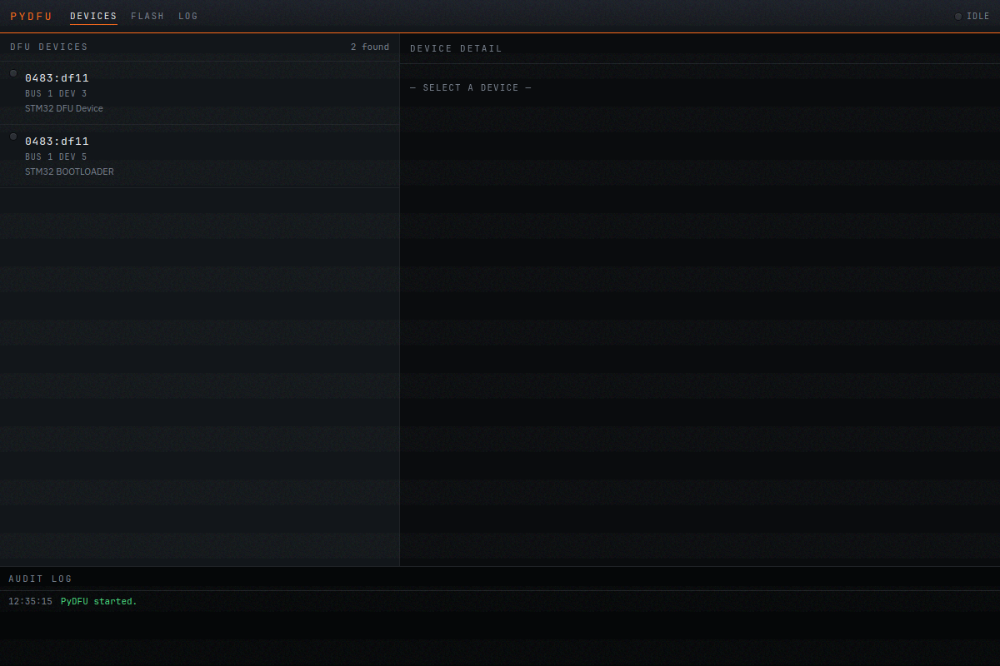
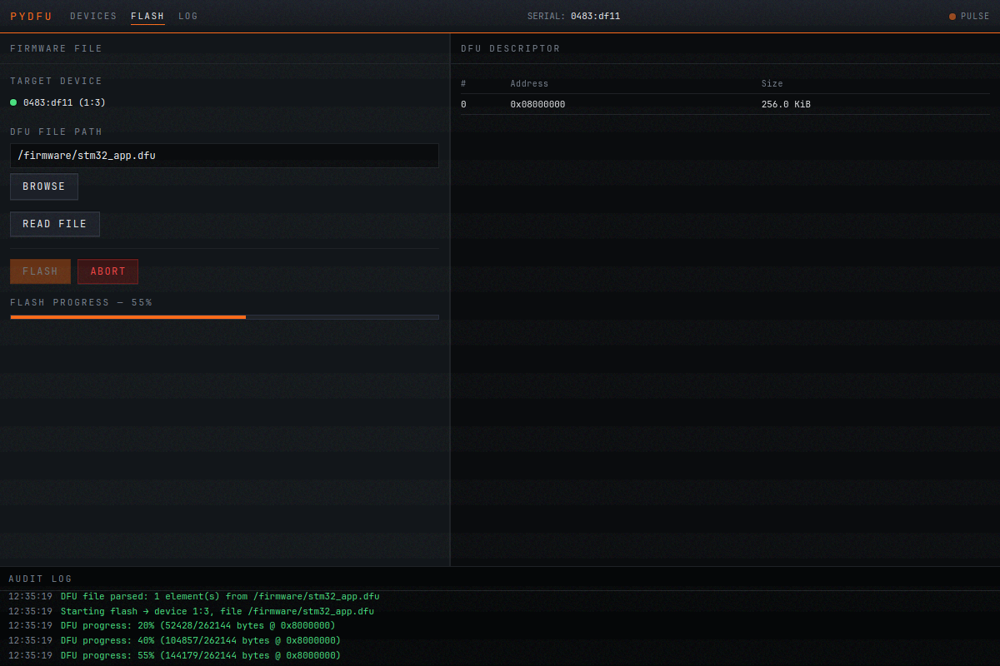
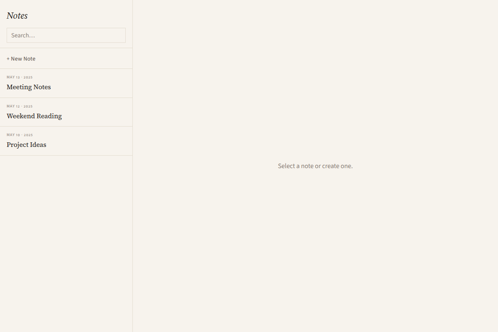
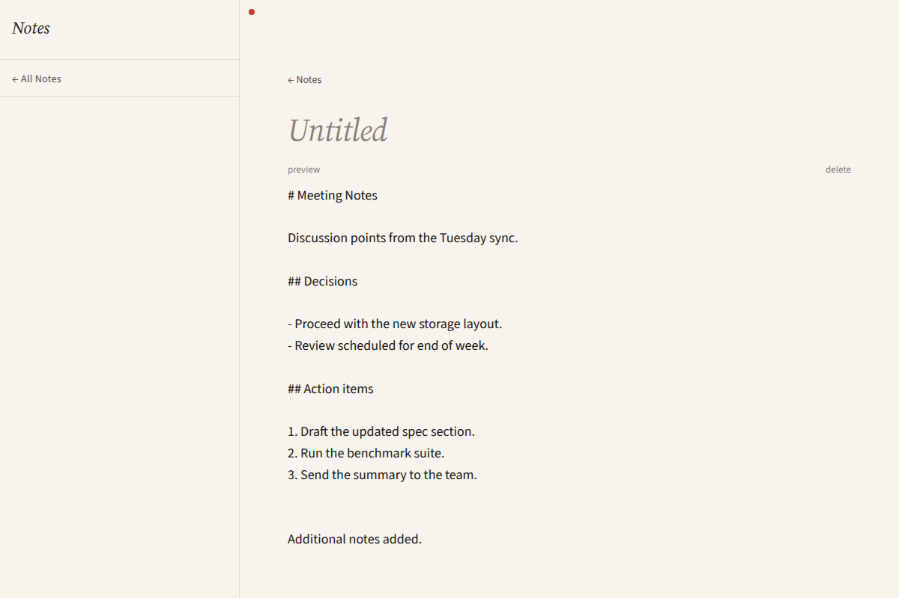
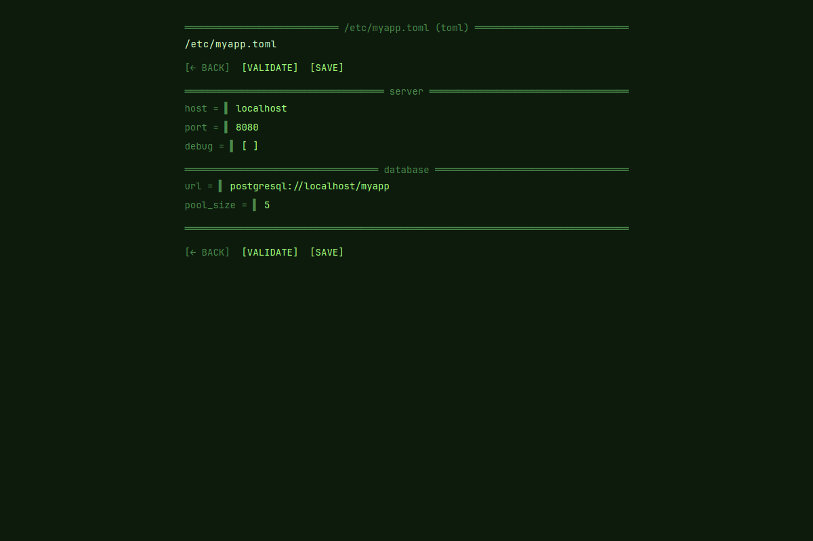
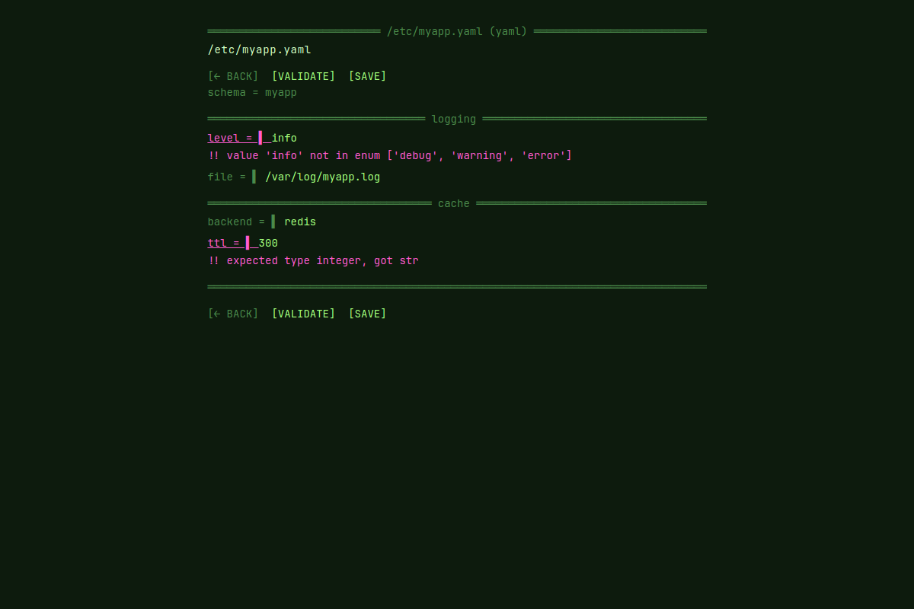
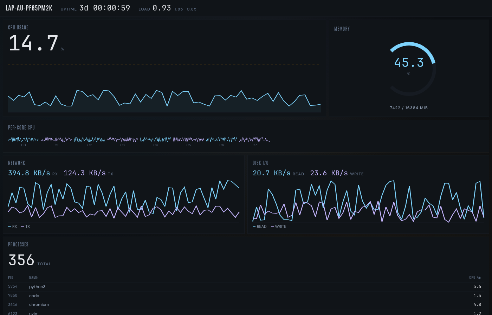
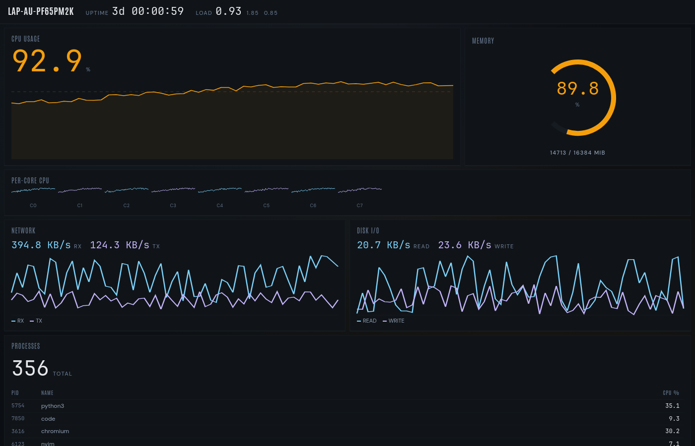

# Picolet examples

Four worked applications, each covering a distinct use case and visual direction.
These are not generic SaaS templates — each commits to a specific aesthetic and
demonstrates a specific set of framework capabilities.

Spec coverage: FR-EX-1, FR-EX-2, FR-EX-3, FR-EX-4, FR-EX-5, FR-EX-6.

---

## pydfu

**Source**: [`examples/pydfu/`](../examples/pydfu/)  
**Template**: `picolet init my-flasher --template pydfu`  
**Spec**: FR-EX-1, FR-EX-7

An industrial-style DFU firmware flasher. The aesthetic is Beckhoff control
panel: near-black matte chassis (`#0a0c0e`), forge-orange accents (`#ff6b1a`),
status LEDs, and monospaced tabular layouts. Not a rounded-corner web form —
a tool that looks like it belongs next to a logic analyser.

It demonstrates three Picolet capabilities that a CRUD app would not touch: host
filesystem access via Python's `pathlib` (opening `.dfu` files the user picks
from a native path), the USB stack via `libusb` (enumerating DFU devices in
DFU mode), and long-running async tasks with fine-grained progress streaming:

```python
@picolet.command
async def flash(args):
    # Returns immediately; progress arrives as pushed events.
    device_id = args["device_id"]
    dfu_path = args["dfu_path"]
    ...
    for block_addr, data in dfu_file.blocks():
        await write_block(device_id, block_addr, data)
        picolet.emit("dfu:progress", {
            "addr": block_addr, "done": done, "total": total, "pct": pct,
        })
    picolet.emit("dfu:done", {"ok": True})
```

The Vue frontend listens on `window.picolet.on("dfu:progress", ...)` and updates
a progress bar and audit strip in real time.

| device-list-populated | flash-mid-progress |
|---|---|
|  |  |

**Try it:**

```
picolet init my-flasher --template pydfu
cd my-flasher && picolet dev
```

---

## notes

**Source**: [`examples/notes/`](../examples/notes/)  
**Template**: `picolet init my-notes --template notes`  
**Spec**: FR-EX-2

A markdown-backed notes app. The aesthetic is editorial: warm off-white paper
(`#f7f3ed`), Source Serif type, a single sharp-red accent for unsaved state.
Not a productivity-SaaS dashboard. The intent is to look like a considered
writing tool.

It demonstrates host filesystem persistence via the platform config directory
(`~/.config/<app>/` on Linux, `%APPDATA%\<app>\` on Windows), multi-route
navigation with Vue Router, and markdown rendering delegated to the JS bundle
(`marked` compiled into the Vite output) rather than the Python side:

```python
@picolet.command
async def save_note(args):
    slug = args.get("slug")
    body = args.get("body", "")
    return store.save_note(slug, body)

@picolet.command
async def list_notes(args):
    return store.list_notes()  # reads ~/.config/notes/ on Linux
```

The Vue side parses markdown with `marked` — the Python layer only stores and
retrieves raw text. This split keeps the MicroPython runtime thin.

| list-populated | edit-unsaved |
|---|---|
|  |  |

**Try it:**

```
picolet init my-notes --template notes
cd my-notes && picolet dev
```

---

## config-editor

**Source**: [`examples/config-editor/`](../examples/config-editor/)  
**Template**: `picolet init my-editor --template config-editor`  
**Spec**: FR-EX-3

A schema-driven config file editor supporting TOML, YAML, and JSON. The
aesthetic is brutalist terminal: phosphor-green-on-black (`#a3ff7c` on
`#0d1b0d`), monospace throughout, deliberate ASCII feel. Not an IDE plugin —
a standalone tool where the schema is the UI.

It demonstrates a structured-data pipeline: the user picks a file, the Python
side parses it (via `tomllib`, `PyYAML`, `json`), validates the document
against a JSON Schema, and presents a diff before writing. The round-trip is
explicit:

```python
@picolet.command
async def validate(args):
    fmt = args["format"]
    document = args["document"]
    schema_name = args["schema_name"]
    errors = store.validate(fmt, document, schema_name)
    return {"errors": errors, "ok": True}

@picolet.command
async def save(args):
    path = args["path"]
    fmt = args["format"]
    document = args["document"]
    return store.save(path, fmt, document)  # returns {"diff": [...], "ok": True}
```

The diff confirmation step — shown as a coloured patch before commit — is the
UI pattern this example is built around.

| edit-toml | edit-yaml-with-errors |
|---|---|
|  |  |

**Try it:**

```
picolet init my-editor --template config-editor
cd my-editor && picolet dev
```

---

## dashboard

**Source**: [`examples/dashboard/`](../examples/dashboard/)  
**Template**: `picolet init my-dash --template dashboard`  
**Spec**: FR-EX-4

A live system-metrics dashboard: CPU, memory, disk, and network, updated at
1 Hz. The aesthetic is data-dense dark: slate base (`#101418`), ice-blue chart
strokes (`#7dd3fc`), amber warning accents (`#f59e0b`). Not another shadcn
dashboard with a sidebar of nav links — a read-only instrument panel.

It demonstrates the event-push pattern: a Python `asyncio` task reads `/proc`
sources once per second, maintains a 60-sample ring buffer, and pushes
`metrics:tick` events. The Vue frontend bootstraps from `get_history()` on
mount, then subscribes to live ticks:

```python
_history: list = []
_HISTORY_MAX = 60

@picolet.command
async def get_history(args):
    return {"history": _history}

async def _metrics_loop():
    while True:
        tick = metrics_reader.collect(_prev)
        _history.append(tick)
        if len(_history) > _HISTORY_MAX:
            _history.pop(0)
        picolet.emit("metrics:tick", tick)
        await asyncio.sleep(1.0)
```

The charts are pure SVG paths computed in Vue and animated with CSS
`transition: d` — no chart library dependency.

| full-dashboard | full-dashboard-with-warning |
|---|---|
|  |  |

**Try it:**

```
picolet init my-dash --template dashboard
cd my-dash && picolet dev
```
