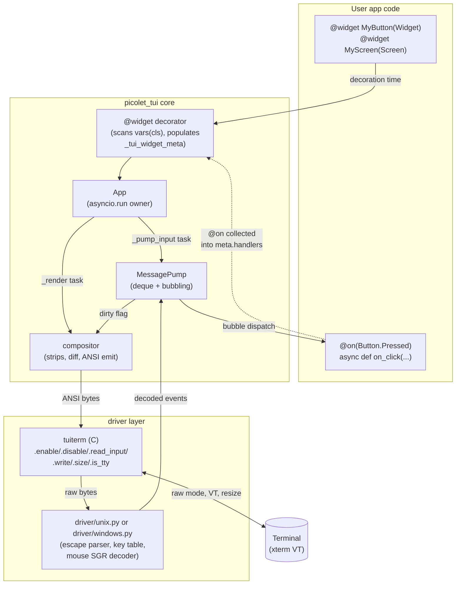

# picolet-tui v0.1 — Specification

## 0. Status + Scope

Status: Draft (Phase 1, post research synthesis).
Source: Phase 0 research in `docs/tui/research/` and the Phase 0
synthesis document.

In-scope for v0.1:

- Single-binary `picolet-runtime-{linux-x64,windows-x64}-tui` variants.
- `picolet_tui` Python framework, frozen as `.mpy` into the runtime.
- Nine widgets: Static, Label, Container, Vertical, Horizontal,
  Button, Input, Stack, ProgressBar.
- `Style(...)` Python DSL (no TCSS).
- `TuiHarness` test driver attached to a real pty / ConPTY.
- Co-residence with the existing picolet asyncio pump and the
  `@picolet.command` / `picolet.invoke` IPC surface.

Out-of-scope for v0.1:

- CSS / TCSS parser and file loader.
- Markdown, syntax highlighting, traceback pretty-printing.
- Animation timeline (`App.animate`, `_animator`).
- Worker threads, `_thread`, thread-keyed structures.
- macOS hosts and any embedded UART target.
- DataTable, Tree, TextArea, RichLog, Tabs, OptionList, Switch,
  RadioSet, Sparkline, dark-mode `Style` behaviour.
- Sixel / Kitty graphics emission.
- Reading TUI settings from the picolet config file. v0.1 reads
  configuration exclusively from the `PICOLET_TUI_*` environment
  variables enumerated in NFR-TUI-27; config-file integration is
  deferred to v0.2.
- Job-control suspend/resume (SIGTSTP / Ctrl+Z handling).
  Suspending a picolet-tui app leaves the alt-screen artefacts visible
  to the parent shell until the user types `reset`; resume is best
  effort.

### Cross-section resolutions

The four source drafts contained the following collisions; the
resolutions below are normative for the rest of this document.

1. **Colour-capability precedence.** The functional draft put
   `PICOLET_TUI_COLOR` ahead of `NO_COLOR`; the NFR draft started the
   chain at `NO_COLOR`. Resolution: `PICOLET_TUI_COLOR` is an
   authoritative test/override hook (FR-TUI-39), followed by the
   `NO_COLOR` > `FORCE_COLOR` > `COLORTERM` > `TERM` > `isatty(1)` >
   fallback ladder from research doc 04. Both FR-TUI-38 and NFR-TUI-7
   reflect this merged ladder.
2. **Binary size budget.** The NFR draft set the total binary cap at
   ≤ 2 MiB (matching the existing webview / lvgl variants); the test
   draft cited ≤ 1.5 MiB. Resolution: NFR-TUI-1 keeps 2 MiB as the
   release gate; the test/perf NFR is recast as a sub-budget on the
   frozen `picolet_tui` `.mpy` (≤ 120 KiB romfs, NFR-TUI-20). The
   `.mpy` budget is the meaningful regression detector; the 2 MiB cap
   is the hard fail.
3. **Startup time threshold.** The NFR draft set ≤ 250 ms Linux /
   ≤ 400 ms Windows for time-to-first-frame; the test draft cited
   ≤ 500 ms on `ubuntu-latest`. Resolution: the spec gates on
   ≤ 250 ms Linux / ≤ 400 ms Windows (NFR-TUI-3). The 500 ms figure is
   retained only as a runner-variance ceiling in the CI matrix
   commentary (§4) and does not gate the build.
4. **`@widget` metadata attribute name.** The FR draft referenced
   `_decorated_handlers`; the architecture and test drafts used
   `_tui_widget_meta["handlers"]`. Resolution: the canonical attribute
   is `_tui_widget_meta` (a dict with keys `reactives`, `computes`,
   `handlers`, `bindings`); FR-TUI-13 has been reworded to match.
5. **ID renumbering.** All `FR-TUI-*` and `NFR-TUI-*` ids are
   globally unique across this document. The functional draft retains
   FR-TUI-1..56; architecture-tier FRs are renumbered to FR-TUI-57..59;
   test-tier FRs are renumbered to FR-TUI-60..75. Post-review
   additions: FR-TUI-76..78 cover tiny-terminal handling, the error
   model, and stdout capture during TUI mode. NFRs: NFR-TUI-1..18
   from the NFR draft, NFR-TUI-19..20 from architecture, NFR-TUI-21..26
   from the test draft, NFR-TUI-27..32 from post-review patches
   (configuration sources, accessibility, log channel, signal restore,
   perf statistical methodology, locale-independent width).

## 1. Functional Requirements (FR-TUI-\*)

### Application lifecycle

| ID | Requirement |
|---|---|
| FR-TUI-1 | `picolet_tui.App` is the user-facing entry class. `App.run()` is the synchronous blocking entry point. If no asyncio loop is currently running, it calls `asyncio.run(self.run_async())` (which owns and tears down a fresh loop). If a loop is already running (e.g. inside the picolet-tui runtime where the picolet asyncio pump owns the loop), `App.run()` raises `RuntimeError` directing the caller to `await App.run_async()` instead. `App.run()` returns the value passed to `App.exit(result)`. |
| FR-TUI-2 | `App.run_async()` is the async entry point and the path used from inside the picolet-tui runtime. It is awaited from an existing asyncio task and shares the running loop with the picolet asyncio pump — it never calls `asyncio.new_event_loop()`, `asyncio.set_event_loop()`, or `asyncio.run()`. It performs driver enable, mounts the root widget, drives the event loop tasks via `asyncio.gather`, and tears down on return. |
| FR-TUI-3 | `App.exit(result=None)` requests an orderly shutdown from any task. The current frame finishes rendering, pending messages drain, the driver is torn down, and `run()` / `run_async()` returns `result`. |
| FR-TUI-4 | `App.quit()` is an alias for `App.exit(None)` and is the default binding target for the `ctrl+q` key. |
| FR-TUI-5 | Exactly one `App` instance may be running per process at a time. A second concurrent `App.run()` raises `RuntimeError` before touching the driver. |
| FR-TUI-6 | `App.run()` must be callable from a `main.py` executed by the picolet-tui runtime variant with no additional asyncio setup. |

### Driver bring-up and tear-down

| ID | Requirement |
|---|---|
| FR-TUI-7 | At the start of `App.run_async()` the framework calls `tuiterm.enable()` (per research doc 04 §4), saving the original terminal state. On any path out of `run_async()` — normal return, exception, or signal — `tuiterm.disable()` is invoked exactly once and restores that state. |
| FR-TUI-8 | The framework installs SIGINT and SIGTERM handlers on Unix and a `SetConsoleCtrlHandler` on Windows that schedule an `App.exit()` and let the current frame complete. The handlers are removed on tear-down. |
| FR-TUI-9 | Terminal resize is observed via SIGWINCH on Unix (set on enable; the C layer flips a `sig_atomic_t` flag that is consumed on the next loop tick via `tuiterm.size()`) and via `GetConsoleScreenBufferInfo` polling on Windows (per 04 §2). On a size change the framework emits a `Resize` event to the root widget and reflows the layout before the next paint. The size comparison runs once per `_pump_resize` tick; no `poll_resize` C entry point is exposed. |
| FR-TUI-10 | The framework refuses to start when either stdin or stdout is not a tty (Unix `isatty(0) == 0` or `isatty(1) == 0`), when `SetConsoleMode(..., ENABLE_VIRTUAL_TERMINAL_PROCESSING)` fails on Windows (pre-1809 conhost — R5), or when any other `OSError` is raised from `tuiterm.enable()` (e.g. `tcgetattr`/`tcsetattr` failure inside a stripped container, `/dev/tty` not openable inside `chroot`). The refusal prints a single-line diagnostic to stderr — including the OS errno when the source is an `OSError` — and exits non-zero without modifying the terminal. The `TuiHarness` driver bypasses this check by allocating a real pty/ConPTY so scripted/CI runs do not trip the refusal. |
| FR-TUI-11 | On enable the framework emits the startup ANSI prologue: alt-screen on (`CSI ?1049 h`), cursor hidden (`CSI ?25 l`), mouse SGR on (`CSI ?1006 h` + `CSI ?1000 h`), bracketed-paste on (`CSI ?2004 h`). On disable it emits the inverse sequences in reverse order before calling `tuiterm.disable()`. |

### Event model

| ID | Requirement |
|---|---|
| FR-TUI-12 | All events derive from `picolet_tui.Message`. The framework dispatches messages by walking the DOM from the originating widget toward the root; a handler may call `message.stop()` to halt bubbling. |
| FR-TUI-13 | The `@on(MessageType, selector=None)` decorator registers a handler on a widget class. The class-time `@widget` decorator collects all `@on`-decorated methods into `cls._tui_widget_meta["handlers"]` exactly once at class-decoration time, with no reliance on `__init_subclass__` or metaclasses. |
| FR-TUI-14 | Method-name-based dispatch is supported as a fallback: a method named `on_<message_class_name_snake_case>` is invoked for the matching message type after `@on`-decorated handlers, both with and without the `Message` instance as an argument (arity is recorded by `@widget` at decoration time using `__code__.co_argcount`). |
| FR-TUI-15 | Key events arrive as `events.Key(key, character, modifiers)` decoded by the parser in research doc 04 §3. The key name matches Textual's vocabulary (`up`, `down`, `enter`, `escape`, `tab`, `f1`..`f12`, `ctrl+a`..`ctrl+z`, modifier-prefixed forms `ctrl+shift+up`, etc.). |
| FR-TUI-16 | Mouse events arrive as `events.MouseDown`, `events.MouseUp`, `events.MouseMove`, `events.MouseScrollUp`, `events.MouseScrollDown` decoded from SGR mouse sequences (`CSI < Cb ; Cx ; Cy M/m`) per research doc 04 §3. Each carries 1-based `(x, y)`, button index, and a `Modifiers` flag derived from the SGR `Cb` field. |
| FR-TUI-17 | Bracketed paste produces a single `events.Paste(text)` event regardless of payload size or embedded control bytes. The parser must not interpret bytes between the open and close markers as keys, mouse events, or commands. |
| FR-TUI-18 | The xterm modifier encoding (`CSI 1 ; N <final>` where `N = 1 + Shift + Alt*2 + Ctrl*4`) is decoded into the `Key.modifiers` field. Modifier-keyed bindings such as `Binding("ctrl+up", "scroll_top")` are matched against the decoded form. |

### Reactive properties

| ID | Requirement |
|---|---|
| FR-TUI-19 | `picolet_tui.Reactive(default, *, layout=False, init=True, always_update=False)` declares a reactive class attribute. The `@widget` decorator binds the descriptor name (replacing `__set_name__`, which MicroPython does not call) and installs `__get__`/`__set__` slots on the owning class. |
| FR-TUI-20 | When a reactive attribute is assigned, the framework calls the watcher method `watch_<name>(self, old, new)` if defined. The arity (`(self, new)` or `(self, old, new)`) is recorded at `@widget` decoration time and the correct number of arguments is passed. |
| FR-TUI-21 | A method named `compute_<name>(self)` declared on the same class registers `<name>` as a computed reactive: reads call `compute_<name>`. Assigning to a computed name raises `ReactiveError` at runtime. A class must not define both `compute_<name>` and a `Reactive(<name>)` descriptor; the `@widget` decorator raises `TooManyComputesError` at decoration time. The two halves are verified independently (collision-at-decoration and write-rejection-at-runtime). |
| FR-TUI-22 | A reactive declared with `layout=True` schedules a layout pass on assignment. A reactive declared with `always_update=True` fires its watcher on every assignment even when `old == new`. |

### Widget lifecycle

| ID | Requirement |
|---|---|
| FR-TUI-23 | `Widget.mount(*children)` appends children to the widget and returns an awaitable that resolves when each child's `on_mount` has run. Mounting is the only supported way to insert a widget into the DOM after `App.compose()`. |
| FR-TUI-24 | `Widget.remove()` (and `Widget.unmount()` as alias) detaches the widget from its parent, invokes `on_unmount` on the widget and its descendants in depth-first order, and releases their message queues. After return the widget is not reachable from the DOM. |
| FR-TUI-25 | The `on_mount(self)` and `on_unmount(self)` lifecycle hooks fire exactly once per mount cycle. They may be `async def` and are awaited in declaration order. |
| FR-TUI-26 | `Widget.focus()` makes the widget the current focus target if it is focusable (`can_focus = True`) and mounted; otherwise it is a no-op and returns `False`. `Widget.blur()` clears focus from the widget if it currently holds it. |
| FR-TUI-27 | The currently-focused widget receives `events.Focus` on focus acquisition and `events.Blur` on focus loss. `Tab` and `shift+tab` cycle focus among focusable widgets in DOM order by default; this binding is overridable. |
| FR-TUI-28 | Every class in a `Widget` subclass's MRO that defines `Reactive` descriptors, `@on`-decorated handlers, `compute_<name>` methods, or a `BINDINGS` class attribute must itself be `@widget`-decorated. Instantiation of an undecorated `Widget` subclass raises `MissingWidgetDecoratorError` from `Widget.__init__`; the `@widget` decorator additionally raises `MissingWidgetDecoratorError` at decoration time if any base class along the MRO is found to declare any of those four artifacts without carrying `_tui_widget_meta` (R3 mitigation, prevents silent loss of metadata from intermediate mixins). |

### Layout

| ID | Requirement |
|---|---|
| FR-TUI-29 | `Container` lays out children with no implicit direction; `Vertical` stacks children top-to-bottom; `Horizontal` arranges children left-to-right. All three accept an explicit `width=` and `height=` constructor argument expressed as either an `int` (cells) or a `Scalar` (`"50%"`, `"1fr"`, `"auto"`). |
| FR-TUI-30 | A child's effective size is determined by the parent's allocation, then the child's declared `width`/`height` from its `Style`, then the child's measured intrinsic size. The layout pass writes a `Region(x, y, width, height)` onto each mounted widget that the compositor consumes. |
| FR-TUI-31 | Layout is recomputed on the first frame after: a widget is mounted or removed; a `Reactive(..., layout=True)` is assigned; the terminal is resized; or `Widget.refresh(layout=True)` is called. No animation is applied to layout changes (D7). |

### Styling

| ID | Requirement |
|---|---|
| FR-TUI-32 | The v0.1 styling surface is the Python-side `Style(...)` DSL (D2). `Style` accepts the keyword arguments enumerated in §3.7 (`color`, `background`, `bold`, `italic`, `underline`, `strike`, `dim`, `blink`, `reverse`, `padding`, `margin`, `border`, `border_color`, `width`, `height`, `min_width`, `max_width`, `min_height`, `max_height`, `align`, `overflow`, `text_overflow`, `visibility`, `layer`) and validates each against the same value space the future TCSS parser will accept. §3.7 is the source of truth; this row is normative on the keyword set. |
| FR-TUI-33 | `color` and `background` accept named colors (`"red"`, `"bright_blue"`, …), hex (`"#a1b2c3"`), `rgb(r, g, b)`, and `"ansi(N)"`. Out-of-range values raise `StyleError` at `Style` construction time, not at render time. |
| FR-TUI-34 | `border` accepts a `(kind, color)` tuple where `kind ∈ {"none", "ascii", "solid", "double", "round", "heavy", "dashed"}`. The compositor picks the corresponding box-drawing glyphs and downgrades to `"ascii"` when the detected color system is `mono` or the `PICOLET_TUI_BORDER=ascii` environment variable is set. |
| FR-TUI-35 | `padding` accepts an `int` (uniform) or a 2-tuple `(vertical, horizontal)` or a 4-tuple `(top, right, bottom, left)`. The padded region is filled with the widget's background color. |
| FR-TUI-36 | `Style.meta` is a plain `dict[str, Any]` with reference semantics on merge (D4). `Style(meta={"id": "abc"}).meta is style.meta` after construction; no copy, no pickle, no JSON round-trip. |
| FR-TUI-37 | `Widget.styles` returns a mutable `Styles` instance for the widget; assigning `widget.styles = Style(...)` replaces it and schedules a redraw. Style changes that do not affect layout (color, bold) skip the layout pass. |

### Color-system detection

| ID | Requirement |
|---|---|
| FR-TUI-38 | At driver enable the framework determines `color_system ∈ {"truecolor", "256", "16", "mono"}` using the precedence in research doc 04 §1 with the `PICOLET_TUI_COLOR` override prepended: `PICOLET_TUI_COLOR` override → `NO_COLOR` → `FORCE_COLOR` → `COLORTERM` → `TERM` → the `"colour"` field returned by `tuiterm.enable()` → `"16"`. The chosen value is read once and cached for the life of the `App`. |
| FR-TUI-39 | `PICOLET_TUI_COLOR=mono|16|256|truecolor` overrides every other source and is the supported test hook for snapshot tests. Any other value is rejected with a one-line stderr diagnostic and the framework falls through to the next source. |
| FR-TUI-40 | All `Color` values emitted by the compositor are downgraded to fit the detected `color_system` using the algorithm in research doc 02 (HLS-grayscale + 6-cube for `truecolor → 256`, AERT perceptual distance against `EIGHT_BIT_PALETTE[:16]` for `256 → 16`, and a mono fallback that emits no SGR color sequences). |

### Widgets — v0.1 set

| ID | Requirement |
|---|---|
| FR-TUI-41 | **Static** — `Static(content="", *, expand=False, shrink=True)` renders an arbitrary string or `RenderableType` and is the base class for every visual widget. It is not focusable. Calling `static.update(content)` replaces the content and triggers a redraw. |
| FR-TUI-42 | **Label** — `Label(text="")` is a single-line `Static` subclass with a `text` reactive. Assigning `label.text = ...` triggers the `watch_text` machinery and a redraw. The widget never wraps; overflow is truncated with `…` when the layout width is shorter than the rendered text. |
| FR-TUI-43 | **Container** — `Container(*children, **kw)` is a non-directional grouping widget. It propagates layout requests to children, has no intrinsic content, and accepts focus only when `can_focus=True` is passed explicitly. |
| FR-TUI-44 | **Vertical** — `Vertical(*children, **kw)` stacks children top-to-bottom and is the default for `Container` when a direction is required by layout. It honours per-child `width=` overrides and distributes any remaining height across `1fr`-declared children. |
| FR-TUI-45 | **Horizontal** — `Horizontal(*children, **kw)` arranges children left-to-right. It honours per-child `height=` overrides and distributes remaining width across `1fr` children. |
| FR-TUI-46 | **Button** — `Button(label, *, id=None, variant="default")` renders a single-line clickable widget. It is focusable. `enter` and `space` keys post `Button.Pressed(button=self)` when focused. A left-click `MouseDown` within the button region posts the same message. `variant ∈ {"default", "primary", "success", "warning", "error"}` selects the default style. |
| FR-TUI-47 | **Input** — `Input(value="", *, placeholder="", password=False, max_length=None)` is a single-line text-entry widget. It is focusable. Printable keys append; `backspace` deletes; arrow keys move the caret; `home`/`end` jump; `ctrl+a`/`ctrl+e` are accepted aliases; `ctrl+u` clears. `enter` posts `Input.Submitted(value=self.value)`; every change posts `Input.Changed(value=self.value)`. |
| FR-TUI-48 | **Input** paste handling: an `events.Paste` event delivered to a focused `Input` inserts the payload at the caret in a single edit step. The paste payload is truncated at `max_length` if set and unrenderable control bytes (`< 0x20`, except `\t`) are stripped before insertion. |
| FR-TUI-49 | **Input** password mode: when `password=True`, every visible character is rendered as `•` (U+2022) and the actual value is still emitted on `Input.Submitted`. Caret movement keys behave on the rendered length. |
| FR-TUI-50 | **Stack** — `Stack(*screens)` holds an ordered set of screen-like child widgets and renders exactly one at a time. `stack.push(widget)` mounts a new top; `stack.pop()` unmounts and returns it; `stack.current` is the visible widget. Focus moves to the new top on `push` and to the new top on `pop`. |
| FR-TUI-51 | **ProgressBar** — `ProgressBar(total=100, *, show_percentage=True, show_eta=False)` is a non-focusable widget with reactive `progress` (0..`total`). The public mutation surface is assignment (`bar.progress = n`) and augmented assignment (`bar.progress += n`); there is no `bar.advance(n)` method in v0.1. Assignment triggers a redraw; the bar uses Unicode block characters (`█ ▉ ▊ ▋ ▌ ▍ ▎ ▏`) at fractional cells when `color_system != "mono"` and ASCII `#` blocks otherwise. `show_eta=True` adds a right-aligned `mm:ss` field computed from a small ring buffer of the most recent `progress` assignment timestamps. |
| FR-TUI-52 | Every v0.1 widget accepts `id=None, classes=""` constructor arguments. `id` is unique within a parent; `classes` is a space-separated set used as a style-target hook in v0.2 TCSS and exposed for inspection in v0.1. |

### Integration with the picolet asyncio pump

| ID | Requirement |
|---|---|
| FR-TUI-53 | The framework uses the single asyncio loop already running under the picolet-tui runtime. It does not call `asyncio.new_event_loop()` or `asyncio.set_event_loop()` from inside `run_async()`. |
| FR-TUI-54 | All framework-internal concurrency uses asyncio `Task`, `Event`, `Queue`, and `gather`. No worker threads, no `_thread`, no `threading.get_ident()` (D6). The pre-0.50 Textual `gather`-based message pump is the porting baseline. |
| FR-TUI-55 | The input-read coroutine calls `tuiterm.read_input(timeout_ms)` (which is non-blocking and returns `b""` on no data) and awaits `asyncio.sleep(0)` between empty reads to yield to peer tasks. There is no blocking `read` and no select-on-stdin from Python. |
| FR-TUI-56 | User commands registered via picolet's existing `@picolet.command` decorator and `picolet.invoke()` IPC continue to work inside a TUI app: they are dispatched on the same asyncio loop and may freely await, post `Message` instances to widgets, and call `App.exit()`. |

### Architecture invariants (renumbered from FR-TUI-ARCH-\*)

| ID | Requirement |
|---|---|
| FR-TUI-57 | The `@widget` class decorator is the single class-registration entry point. It walks `vars(cls)` (only), populates `cls._tui_widget_meta` with `reactives`, `computes`, `handlers`, `bindings`, assigns `Reactive._attr_name` (replacing `__set_name__`), and merges parent meta along the MRO with subclass-wins precedence. No `__init_subclass__`, no custom metaclass, no `dir()` / `inspect.getmembers` walk. |
| FR-TUI-58 | The `tuiterm` C module exposes exactly the six-function surface (`enable`, `disable`, `read_input`, `write`, `size`, `is_tty`) on both Unix and Windows with identical signatures and identical return shapes. `enable` and `disable` are idempotent. The C module does not parse escape sequences, decode mouse events, or maintain a key table — that work is frozen Python. |
| FR-TUI-59 | `App.run_async()` schedules exactly three named tasks on the existing asyncio loop via `asyncio.gather`: `_pump_input` (event-driven, 16 ms `read_input` poll), `_pump_resize` (250 ms tick), and `_render` (dirty-flag-driven). The loop itself is owned by either the picolet asyncio pump (runtime path) or by `asyncio.run` invoked from `App.run()` (synchronous-entry path) — never by `run_async()` itself. Cancellation of the gather invokes `tuiterm.disable()` exactly once before returning. `TaskGroup` is not used (D6 pins pre-0.50 Textual semantics). |

### Test surface (renumbered from FR-TUI-TEST-\*)

| ID | Requirement |
|---|---|
| FR-TUI-60 | `picolet_tui.testing.TuiHarness` is the only public test driver for v0.1. Its public API surface (async context manager, `send`, `press`, `wait_idle`, `frame`, `cells_at`, `style_at`, `aclose`) is fixed by §4 "AppHarness API" and is non-breaking for subsequent v0.x releases. |
| FR-TUI-61 | `TuiHarness` allocates a pty on Linux and a ConPTY on Windows. mintty / Cygwin pty emulation is rejected with an explicit construction-time error message. |
| FR-TUI-62 | The byte-stream parser used by `TuiHarness` is imported from the same module the runtime uses for input parsing — no parallel implementation. `TuiHarness._parser is picolet_tui._parser` is asserted in CI. |
| FR-TUI-63 | `TuiHarness.wait_idle()` synchronises on a DSR-6 (Device Status Report cursor position) query / CPR (Cursor Position Report) reply round-trip. No wall-clock sleeps are required in widget tests. |
| FR-TUI-64 | Every shim in the Phase 2b shim pack ships both `tests/shims/<name>_cpython.py` and `tests/shims/<name>_mp.py`. The latter runs under the picolet-tui micropython-host build via `tests/run-shim-tests.sh`. |
| FR-TUI-65 | Every Rich module in the Tier 1 + Tier 2 keep list (research doc 02 §"Minimum Subset") has its upstream test file ported under `tests/rich/`, each with the upstream commit SHA recorded as a header comment. |
| FR-TUI-66 | The `@widget` decorator has named tests covering populated metadata (`tests/core/test_widget_decorator.py::test_decorator_populates_meta`) and the missing-decorator error (`::test_missing_decorator_raises`). |
| FR-TUI-67 | `Reactive` watchers fire exactly once per assignment with `(old, new)`, asserted by `tests/core/test_reactive.py::test_set_triggers_watcher`. |
| FR-TUI-68 | `Message` bubbling reaches `@on(...)` handlers on ancestors and `event.stop()` halts bubbling, asserted by `tests/core/test_message.py::test_bubble_to_on_decorator` and `::test_stop_propagation`. |
| FR-TUI-69 | Each of the nine v0.1 widgets has at least one AppHarness smoke test under `tests/widgets/test_<widget>.py` asserting the behaviour listed in §4 "Widget tests". |
| FR-TUI-70 | `tests/integration/test_tui_pydfu.py` builds the tui-pydfu example, runs it under `TuiHarness` against a stubbed USB DFU back-end injected via env var, and asserts the final frame against a recorded snapshot. |
| FR-TUI-71 | `tests/check-coverage.py` fails CI if any `FR-TUI-*` id in this spec lacks a corresponding row in the verification matrix in §4. The script itself is verified by `tests/meta/test_check_coverage.py`, which runs `check-coverage.py` against a synthetic spec fixture that omits one row and asserts a non-zero exit code; this meta-test prevents a silent-pass bug in the coverage gate. The script additionally prints the count of FRs checked at the end of each CI run for visual sanity. |
| FR-TUI-72 | `tools/check-symbols.{sh,ps1}` is a second-line defence on top of the NFR-TUI-18 import-table allow-list: it fails the build if the picolet-tui binary contains specific known-bad symbols (`SDL_*`, `tigetstr` / `setupterm`, `init_color` / `initscr`, `gtk_*`, `webkit_*`, WebView2 loader, `dlopen` of `libSDL2.so` or `libncurses*.so`) even when reached via dynamic load (which would otherwise bypass the static import-table check). |
| FR-TUI-73 | `tools/check-static.{sh,ps1}` fails the build if the picolet-tui binary dynamically links anything outside the platform baseline allow-list (libc/libm/libpthread/libdl on Linux; kernel32/user32/msvcrt/ucrtbase on Windows). |
| FR-TUI-74 | `tools/perf-check.py --variant tui` runs startup and `input-echo` cases and gates against NFR-TUI-3 and NFR-TUI-4. |
| FR-TUI-75 | The CI workflow `.github/workflows/tui-release.yml` runs the full test suite on `ubuntu-latest` and `windows-2022` lanes; no macOS lane. |

### Post-review additions

| ID | Requirement |
|---|---|
| FR-TUI-76 | The minimum useful terminal size is 20 columns × 5 rows. When `tuiterm.size()` returns a smaller geometry, the compositor skips the normal layout pass and paints a single centred line "Terminal too small (cols×rows, need 20×5)" in default colors against a default background, then waits for the next `Resize` event before resuming normal rendering. Verified by `tests/integration/test_tiny_terminal.py`. |
| FR-TUI-77 | Exception model: `picolet_tui.errors` defines `PicoletTuiError` (base), `ReactiveError`, `TooManyComputesError`, `MissingWidgetDecoratorError`, `StyleError`, `HarnessError`, and `PtyAllocError`. User-handler exceptions raised inside `@on`-decorated methods or `on_<message>` name-dispatched methods are caught at the `_dispatch` boundary, logged to stderr (NFR-TUI-29) with traceback and bubbling continues to the next ancestor. If `App.on_unhandled_exception(exc)` is defined it is invoked with the exception; the framework never exits on a user-handler exception unless that hook re-raises. |
| FR-TUI-78 | While the driver is enabled, the framework redirects `sys.stdout` writes that did not originate from `tuiterm.write` into a per-app ring buffer (default 64 KiB). On disable the buffer is flushed to the real stderr file descriptor. User code that wants visible logging during run should call `App.log(msg)`, which writes directly to stderr. Verified by `tests/integration/test_print_capture.py`. |

## 2. Non-Functional Requirements (NFR-TUI-\*)

| ID | Requirement |
|---|---|
| NFR-TUI-1 | `picolet-runtime-{linux-x64,windows-x64}-tui` binary ≤ 2 MiB. Budget breakdown: ~1 MiB MicroPython core + asyncio (parity with v1 NFR-1), ~120 KiB frozen `picolet_tui` core (synthesis §4; NFR-TUI-19), ~60 KiB frozen `picolet_tui/_rich/` subtree (~7,500 LoC trimmed Rich), ~20 KiB frozen `picolet_tui/_shims/` (~1,200 LoC shim pack), ~10 KiB `tuiterm` C shim (04 §4), ~8 KiB parser/key-table romfs. The remainder is link/CRT overhead and headroom. The three frozen sub-budgets are gated independently in NFR-TUI-19. |
| NFR-TUI-2 | The tui variant requires no system Python and no runtime sidecar libraries on either target. No `libtui.so`, no `tuiterm.dll`, no font files. (Inherits NFR-4 and CLAUDE.md §"Single-binary output is non-negotiable".) |
| NFR-TUI-3 | Time-to-first-frame (process start → first compositor flush to terminal) ≤ 250 ms on linux-x64 and ≤ 400 ms on windows-x64, measured on the `perf-check.yml` lane against the `hello-tui` template. Mirrors NFR-EX-2 but scoped to a TUI process with no window-manager handshake. |
| NFR-TUI-4 | Frame latency (key byte arrives at `tuiterm.read_input` → ANSI bytes flushed to stdout) p95 ≤ 16 ms, p99 ≤ 33 ms on linux-x64 idle, measured with `TuiHarness` scripted keystrokes against the v0.1 `Input` widget echo path over 1000 keystrokes. |
| NFR-TUI-5 | Steady-state heap usage ≤ 512 KiB for the `hello-tui` template after first frame and ≤ 1 MiB for `tui-pydfu` mid-transfer. Measured via `gc.mem_alloc()` sampled by `TuiHarness` after a forced `gc.collect()`. |
| NFR-TUI-6 | All `functools.lru_cache` instances inside `picolet_tui` and the trimmed Rich subset default to `maxsize=128`, not 1024 (synthesis R4 mitigation a). Verified by an import-time test that walks `picolet_tui.__dict__` and the trimmed `rich.*` modules and asserts `cache_info().maxsize <= 128` on every wrapped callable. |
| NFR-TUI-7 | Colour-capability detection follows the precedence: `PICOLET_TUI_COLOR` override (FR-TUI-39) → `NO_COLOR` (non-empty → mono) → `FORCE_COLOR` (non-empty → truecolor) → `COLORTERM ∈ {truecolor, 24bit}` → truecolor → `TERM` contains `256color` → 256 → `TERM` in known-color set → 16 → `isatty(1) == 0` → mono → fallback → 16. On Windows the ladder runs only after `SetConsoleMode(hOut, ENABLE_VIRTUAL_TERMINAL_PROCESSING)` succeeds; failure pins capability to mono. |
| NFR-TUI-8 | Supported hosts: Ubuntu 22.04+ (glibc 2.31+) for linux-x64; Windows 10 22H2 and Windows 11 for windows-x64. No macOS in v0.1. No pre-1809 Windows console (04 §5). Hard refuses to start on pre-1809 with a single-line actionable error referencing the required mode flag. |
| NFR-TUI-9 | Minimum MicroPython baseline: the version pinned at the `picolet-runtime/micropython` submodule HEAD at v0.1 ship. Required build flags in `mpconfigvariant.h`: `MICROPY_PY_SELECT=1`, `MICROPY_PY_COLLECTIONS_DEQUE=1`, `MICROPY_PY_COLLECTIONS_ORDEREDDICT=1`, `MICROPY_PY_WEAKREF=1`, `MICROPY_PY_RE_MATCH_GROUPS=1`, `MICROPY_PY_RE_SUB=1`, `MICROPY_PY_ASYNCIO=1`, `MICROPY_PY_IO_IOBASE=1`. `MICROPY_PY_THREAD=0` (D6). Verified by a runtime test inside the built picolet-tui binary that imports / exercises each gated module — `import select`, `from collections import deque, OrderedDict`, `import weakref`, `import re` then `re.match` with named groups and `re.sub`, `import asyncio`, `import io`, and asserts `import _thread` raises `ImportError` — not by text-grep on the generated header. |
| NFR-TUI-10 | Regex engine: ships re1.5 (status quo) with hand-rolled tokenizers for Rich markup and any v0.1 style strings (synthesis D9). No pcre2 swap in v0.1. Verified by (a) absence of any `pcre2` symbol in the linked binary (`nm` / `objdump -T`), (b) presence of a `picolet_tui._tokenizer` module covering markup + bracket-paste edge cases, and (c) `tests/static/test_re_usage.py` greps `picolet_tui/**/*.py` for `re.` calls and fails on use of `(?P<...>)` named groups, `(?i)` / `(?m)` / `(?s)` inline flags, or `re.IGNORECASE|MULTILINE|DOTALL` keyword flag arguments — none of which re1.5 supports. |
| NFR-TUI-11 | Single-thread runtime model. The variant builds with `_thread` disabled (NFR-TUI-9). No `threading.get_ident`-keyed structures, no worker threads, no signal-handler work beyond setting a `sig_atomic_t` flag (04 §1). Compositor, parser, and event loop all run on the single asyncio loop. Verified by a `TuiHarness` test that imports the whole `picolet_tui` surface and asserts `sys.modules.get('_thread') is None`. |
| NFR-TUI-12 | Animation surface is absent in v0.1 (D7). No `picolet_tui.animation` module, no `App.animate()`. Verified by an import-time test that asserts `hasattr(picolet_tui, 'animation') is False` and `hasattr(App, 'animate') is False`. |
| NFR-TUI-13 | Unicode width data is exactly the 15.1.0 table from research doc 02 §"Needed Shims" / D5; ~670 LoC of static data frozen as `picolet_tui._cells_data`. No other width tables shipped. Verified by a checksum test against the upstream Unicode 15.1.0 `EastAsianWidth.txt` derivation. |
| NFR-TUI-14 | Output byte stream conforms to xterm VT100/VT500, ECMA-48 SGR, the SGR 1006 mouse extension, and bracketed paste (`CSI ? 2004 h/l`). DCS sequences are accepted by the parser and discarded without dispatch (04 §3, §5). Verified by a corpus test feeding a recorded xterm session into the parser and asserting the event stream matches a golden fixture. |
| NFR-TUI-15 | No GPL or AGPL components are statically linked into the tui variant. (Inherits NFR-5.) The trimmed Rich subset and Textual-inspired core ship under MIT; the Unicode width table derivation carries its Unicode license notice in the SBOM. |
| NFR-TUI-16 | Test coverage gate: every v0.1 widget (Static, Label, Container, Vertical, Horizontal, Button, Input, Stack, ProgressBar — D3) has at least one `TuiHarness`-based smoke test that scripts an input sequence and asserts on the captured ANSI strip diff. Every public class in `picolet_tui` (`App`, `Screen`, `Widget`, `Reactive`, `Message`, `Binding`, `Style`) has at least one unit test against the picolet-tui binary, not host CPython. CI fails if either gate regresses. |
| NFR-TUI-17 | Documentation gate: v0.1 ships `docs/tui/getting-started.md`, `docs/tui/authoring-widgets.md`, and `docs/tui/migration-from-textual.md`. CI fails the v0.1 release tag if any file is missing, shorter than 500 words, or missing a required section. Required sections per file: `getting-started.md` — "Install", "Hello world", "Recovery after a crash" (covers NFR-TUI-30 `reset` advice); `authoring-widgets.md` — "The `@widget` decorator" (R3 mitigation), "Reactive properties", "Message handlers", "Style DSL"; `migration-from-textual.md` — "Dropped surface" enumerating each item in the §0 out-of-scope list with the v0.1 substitute or "deferred". Implemented by `tests/check-docs.py` parsing the markdown headings and word-counting body text. |
| NFR-TUI-18 | Build-time import-table check: after link, `objdump -p` (Linux) / `objdump -p` against the PE (Windows) is run on the tui artifact and the build fails if the import table contains anything outside the agreed system-library allow-list (`libc.so.6`, `libm.so.6`, `libpthread.so.0`, `libdl.so.2` on Linux; `KERNEL32.dll`, `msvcrt.dll`, `ucrtbase.dll` on Windows). Matches the existing pattern in `packages/picolet-runtime/scripts/build-runtime.sh`. |
| NFR-TUI-19 | Frozen `picolet_tui` `.mpy` footprint budget (D8), measured by `picolet inspect-romfs` on the produced tui artifact and gated in CI: `picolet_tui/` excluding the `_rich/` and `_shims/` subtrees ≤ 120 KiB romfs; the `picolet_tui/_rich/` subtree ≤ 60 KiB romfs; the `picolet_tui/_shims/` subtree ≤ 20 KiB romfs. The three sub-budgets sum to ≤ 200 KiB, which sits inside the ~210 KiB allocation in the NFR-TUI-1 breakdown (~120 KiB core + ~80 KiB Rich/shims + ~10 KiB margin). All three sub-budgets are independent regression detectors; any one over-budget fails the build. |
| NFR-TUI-20 | `MICROPY_PY_THREAD` is disabled in the tui variant build, verified by a build-step grep on the generated `mpconfigvariant.h` and a runtime test asserting `import _thread` raises `ImportError` inside the tui variant binary. |
| NFR-TUI-21 | `TuiHarness` virtual screen fails any test on unknown ANSI input rather than silently ignoring it; the raw offending bytes are included in the failure message. Verified by `tests/harness/test_unknown_ansi_fails.py`. |
| NFR-TUI-22 | Widget and integration tests contain no wall-clock `sleep`. Synchronisation is exclusively via `wait_idle()`. Enforced by `tests/check-no-sleep.py` (grep for `asyncio.sleep`/`time.sleep` with non-zero argument under `tests/widgets/` and `tests/integration/`). |
| NFR-TUI-23 | The Windows CI lane gates on build success, conformance, and startup time only. Frame-latency numbers from Windows runners are recorded as informational; they do not fail the build (runner variance is too high for a meaningful gate). |
| NFR-TUI-24 | Total picolet-tui binary ≤ 2 MiB (duplicate of NFR-TUI-1, restated as the test-driven release gate). The CI `release.yml` step runs `wc -c` on the produced `picolet-runtime-{linux-x64,windows-x64}-tui` artifact and fails the build if > 2,097,152 bytes. |
| NFR-TUI-25 | Time-to-first-frame gate is enforced via `tools/perf-check.py --variant tui --case startup` over 20 runs with p95 against the NFR-TUI-3 thresholds (250 ms Linux / 400 ms Windows). |
| NFR-TUI-26 | Input-echo frame-latency gate is enforced via `tools/perf-check.py --variant tui --case input-echo` over 1000 keystrokes with p95 ≤ 16 ms on the linux-x64 lane. Not gated on Windows (NFR-TUI-23). |
| NFR-TUI-27 | Configuration sources, in precedence order: (1) `PICOLET_TUI_*` environment variables — recognised keys in v0.1 are `PICOLET_TUI_COLOR` (FR-TUI-39), `PICOLET_TUI_BORDER` (FR-TUI-34), `PICOLET_TUI_DEBUG` (NFR-TUI-29); (2) any value picolet itself injects via the runtime environment. The picolet config file is **not** read in v0.1 — see §0 out-of-scope. Verified by `tests/static/test_config_sources.py` enumerating every `os.environ.get` and `os.getenv` call inside `picolet_tui/**/*.py` and asserting the key is in the recognised set. |
| NFR-TUI-28 | Accessibility posture for v0.1: no animation is emitted (NFR-TUI-12); high-contrast palettes are obtained by setting `PICOLET_TUI_COLOR=mono` or `=16`; screen-reader hostility is documented in `docs/tui/getting-started.md` as a caveat (the framework owns stdout and emits raw ANSI which most screen readers do not interpret). Full screen-reader integration and a `prefers-reduced-motion`-style toggle are deferred to v0.2. |
| NFR-TUI-29 | Framework diagnostic channel: all internal diagnostics (queue overflow, malformed escape sequence dropped, capability detection notes when `PICOLET_TUI_DEBUG=1`, `User handler exception` tracebacks per FR-TUI-77) go to stderr. The framework never writes to stdout outside the compositor's ANSI stream owned by `tuiterm.write`. Verified by `tests/static/test_no_print_to_stdout.py` (grep for `print(` calls without `file=sys.stderr`). |
| NFR-TUI-30 | Terminal restoration after uncatchable process death (SIGKILL, SIGQUIT, segfault before signal-handler install, host shutdown before `atexit` runs) is the user's responsibility; `docs/tui/getting-started.md` documents `reset` (and `stty sane` as a partial fallback) as the recovery command. No watchdog process is shipped in v0.1. |
| NFR-TUI-31 | Performance statistical methodology applies uniformly to NFR-TUI-3, NFR-TUI-4, NFR-TUI-5, NFR-TUI-25, NFR-TUI-26: each measurement runs ≥ 100 samples on the gating lane and reports p95 with the 95% confidence interval; the gate fails if the upper CI bound exceeds the threshold. Heap caps (NFR-TUI-5) are sampled after a forced `gc.collect()` and after the first frame for the startup heap or after 60 seconds idle for the steady-state heap. Implemented by `tools/perf-check.py` and `tests/integration/test_heap_caps.py`. |
| NFR-TUI-32 | Locale independence: the Unicode 15.1.0 width table (NFR-TUI-13) is consulted unconditionally; `LANG` / `LC_CTYPE` are ignored. Verified by `tests/integration/test_locale_independence.py` running the same `hello-tui` smoke test under `LANG=C` and `LANG=en_US.UTF-8` and asserting byte-identical frame output. |

## 3. Architecture

This section fixes the on-disk layout, the C/Python boundary, the
asyncio task topology, the class-decoration algorithm, the message
bubbling algorithm, and the Style DSL surface. Everything below is
locked input for Phases 2-5; downstream phases extend, they do not
revise.

### 3.1 Variant skeleton

picolet-tui is a third runtime variant, parallel to `cli`, `webview`,
`lvgl`. Files under `packages/picolet-runtime/`:

```
variants/tui/unix/mpconfigvariant.mk
variants/tui/unix/mpconfigvariant.h
variants/tui/unix/tuiterm.c            # ~250 LoC, termios + SIGWINCH
variants/tui/windows/mpconfigvariant.mk
variants/tui/windows/mpconfigvariant.h
variants/tui/windows/tuiterm.c         # ~300 LoC, conhost VT
manifests/manifest_tui_unix.py
manifests/manifest_tui_windows.py
```

`mpconfigvariant.mk` selects the right `tuiterm.c` per port via
`SRC_USERMOD_C += $(VARIANT_DIR)/tuiterm.c` and adds the frozen
`picolet_tui` manifest. `mpconfigvariant.h` enables the regex,
weakref, deque, ordered-dict, and select build flags listed in §3.7.

The Windows variant adds no extra libraries: MinGW links `kernel32`
by default. The Unix variant has no extra deps beyond what
`picolet-cli` already pulls.

### 3.2 Python package layout

Frozen under `packages/picolet-runtime/python/picolet_tui/`:

```
picolet_tui/
  __init__.py            # public API re-exports
  app.py                 # App, Driver protocol, run() entry
  widget.py              # Widget base, @widget decorator
  message.py             # Message, MessagePump, @on decorator
  reactive.py            # Reactive descriptor + watch dispatch
  screen.py              # Screen, ScreenStack
  binding.py             # Binding, BINDINGS class-attr handling
  compositor.py          # render strips, diff, ANSI emit
  style.py               # Style DSL (no CSS parser in v0.1)
  driver/
    unix.py              # tuiterm wiring for Unix
    windows.py           # tuiterm wiring for Windows
    headless.py          # TuiHarness driver (Phase 7)
  widgets/
    __init__.py
    static.py
    label.py
    container.py         # Container, Vertical, Horizontal
    button.py
    input.py
    stack.py
    progress_bar.py
  _rich/                 # Phase 3 trimmed Rich subset
    __init__.py
    segment.py
    color.py
    cells.py             # Unicode 15.1.0 width table
    style.py             # Rich Style (distinct from picolet_tui.style)
    measure.py
    markup.py            # hand-rolled tokenizer; no re flags
    text.py
    console.py           # trimmed RenderHost (~600 LoC)
  _shims/                # Phase 2b stdlib shims
    __init__.py
    dataclasses.py
    typing.py
    enum.py
    functools.py         # lru_cache, wraps, total_ordering, cached_property
    weakref.py           # WeakSet, WeakValueDictionary, WeakKeyDictionary
    contextlib.py        # AsyncExitStack, asynccontextmanager, nullcontext
    callback.py          # count_parameters() replacing inspect.signature
```

The `_rich` subpackage uses a leading underscore: it is not part of
the public API. Apps must not import from `picolet_tui._rich.*`.
`__init__.py` re-exports the surface that apps are expected to touch
(`App`, `Widget`, `widget`, `on`, `Reactive`, `Style`, `Binding`,
`Message`, and the nine widget classes).

`_shims/` is loaded before any other `picolet_tui` module via a
top-level import in `picolet_tui/__init__.py`. The shims register
themselves into `sys.modules` under their real stdlib names
(`sys.modules["dataclasses"] = _shims.dataclasses`) so downstream
imports resolve without per-callsite rewrites.

### 3.3 C/Python boundary: `tuiterm`

The only C surface is the `tuiterm` module. Both ports expose
identical signatures so the driver Python layer is platform-agnostic.

| Function | Signature | Lifecycle |
|---|---|---|
| `tuiterm.enable()` | `() -> dict` | Called once at app start. Snapshots original terminal state. Returns a capabilities dict: `{"rows": int, "cols": int, "colour": "mono"\|"16"\|"256"\|"truecolor", "vt_input": bool, "bracketed_paste": bool}`. Idempotent: second call returns the same dict without re-snapshotting. Raises `OSError` if stdin/stdout is not a tty or, on Windows, if `ENABLE_VIRTUAL_TERMINAL_PROCESSING` fails (pre-1809 conhost — R5). |
| `tuiterm.disable()` | `() -> None` | Restores the snapshot. Also registered via `atexit` and via SIGTERM/SIGINT/SIGHUP (Unix) and `SetConsoleCtrlHandler` for CLOSE/LOGOFF/SHUTDOWN (Windows). Idempotent. Safe to call from a signal handler. |
| `tuiterm.read_input(timeout_ms)` | `(int) -> bytes` | Non-blocking read. Returns immediately with `b""` if no bytes are pending and `timeout_ms == 0`; otherwise waits up to `timeout_ms` for at least one byte using `poll(POLLIN)` on Unix or `WaitForSingleObject` on Windows. Never raises on EAGAIN; raises `OSError` on closed stdin. |
| `tuiterm.write(data)` | `(bytes) -> None` | Straight passthrough to `STDOUT_FILENO` / stdout handle. Buffered at the C side; flush is implicit per call. |
| `tuiterm.size()` | `() -> (int, int)` | Returns `(cols, rows)`. Unix: `ioctl(TIOCGWINSZ)`. Windows: `GetConsoleScreenBufferInfo`. Cheap; safe to call once per frame. |
| `tuiterm.is_tty(fd)` | `(int) -> bool` | `isatty(fd)` on Unix, `_isatty(fd)` on Windows. Used by the App to refuse to start on a pipe. |

The C module does **not** parse escape sequences, decode mouse
events, or maintain a key table. That is all frozen Python (`driver/`
plus the `_rich`-adjacent parser, total ~500 LoC). The cost of an
extra C module wiring is bounded; the cost of doing parser work in C
is unbounded — keep it in Python.

Resize events are pull-only: the App polls `tuiterm.size()` each
frame (or each `_pump_resize` tick) and synthesises a `ResizeEvent`
on change. No `SIGWINCH` callback into Python — Unix sets a
`sig_atomic_t` inside C and clears it on the next `size()` call; the
Python loop polls.

### 3.4 Asyncio integration

`App.run_async()` joins the already-running loop (the picolet-tui
runtime owns the loop via the picolet asyncio pump); only the
synchronous `App.run()` entry point ever calls `asyncio.run`, and only
when no loop is currently running (FR-TUI-1, FR-TUI-2, FR-TUI-53). No
worker threads (D6). No `loop.run_in_executor`. Inside the runtime the
loop drives three concurrent tasks created from `App._main` via
`asyncio.gather`:

| Task | Period | Responsibility |
|---|---|---|
| `_pump_input` | event-driven | Loops `data = tuiterm.read_input(timeout_ms=16)`; feeds bytes into the escape parser; `await message_pump.post(event)` for each decoded event. The 16 ms poll doubles as the input clock so a wedged screen still cycles. |
| `_pump_resize` | 250 ms | `cols, rows = tuiterm.size()`; if changed, posts a `ResizeEvent`. On Unix this is the consumer of the SIGWINCH `sig_atomic_t` flag. |
| `_render` | dirty-flag | `await dirty_event.wait()`; runs the compositor; emits ANSI via `tuiterm.write`; clears the dirty flag. Coalesces multiple dirty wakes inside one frame. |

The three tasks are created in `App._main` via `asyncio.gather` —
**not** `TaskGroup` (D6 pins pre-0.50 Textual semantics).
Cancellation propagates: a `KeyboardInterrupt` cancels the gather,
the `finally` in `_main` calls `tuiterm.disable()` exactly once, and
control returns to the caller of `run_async()` — the loop continues
running because picolet owns it. The synchronous `App.run()` entry
point (FR-TUI-1) is the only path that owns a loop via `asyncio.run`;
inside the runtime, control simply returns to the picolet pump. There
is no concurrent timer task; widget timers are scheduled via
`loop.call_later` on the same loop.

Back-pressure: the message queue is a `collections.deque` with a soft
cap (default 4096). Overflow drops the oldest event and logs; this
matches Textual's pre-0.50 behaviour and means a wedged widget cannot
OOM the app.

### 3.5 `@widget` class decorator algorithm

The decorator is the **only** place class-time introspection lives
(D1). At decoration time, run:

```python
def widget(cls):
    meta = {"reactives": {}, "computes": {}, "handlers": {}, "bindings": []}
    for name, value in vars(cls).items():
        if isinstance(value, Reactive):
            meta["reactives"][name] = value
            value._attr_name = name              # replaces __set_name__
        elif name.startswith("compute_") and callable(value):
            meta["computes"][name[len("compute_"):]] = value
        elif callable(value) and getattr(value, "_tui_on", None):
            for selector in value._tui_on:
                meta["handlers"].setdefault(selector.message_type, []).append((value, selector))
        elif name == "BINDINGS" and isinstance(value, (list, tuple)):
            meta["bindings"].extend(Binding._coerce(b) for b in value)
    # merge in parent meta from the MRO walk (deterministic, no metaclass)
    for base in cls.__mro__[1:]:
        parent_meta = getattr(base, "_tui_widget_meta", None)
        if parent_meta:
            _merge_meta(meta, parent_meta)       # child wins on key collision
    cls._tui_widget_meta = meta
    cls._tui_widget_registered = True
    return cls
```

Three properties matter:

1. The walk is over `vars(cls)` only — MicroPython supports this
   reliably. No `dir(cls)`, no `inspect.getmembers`.
2. MRO merging is explicit; without `__init_subclass__` the decorator
   does the merge itself. Subclass keys override parent keys.
3. `Reactive._attr_name = name` is the substitute for `__set_name__`,
   which MicroPython does not call.

Mitigation for R3 (forgotten decorator): `Widget.__init__` asserts
`type(self)._tui_widget_registered is True` and raises
`MissingWidgetDecoratorError(cls)` with the exact class name and a
pointer to the docs. The assert fires on first instantiation only;
runtime cost is one attribute lookup.

A second-line defence in `mpm check` (Phase 6) statically flags any
`Widget` subclass without `@widget`.

### 3.6 Message bubbling algorithm

No metaclass, no `_MessagePumpMeta`. Bubbling walks the DOM upward
through the parent chain stored on each `MessagePump`:

```python
async def _dispatch(node, message):
    while node is not None:
        meta = type(node)._tui_widget_meta
        for handler, selector in meta["handlers"].get(type(message), ()):
            if selector.matches(node, message):
                stop = await _invoke(handler, node, message)
                if stop is True or message._stop_bubble:
                    return
        node = node._parent
```

`@on(MessageType, selector=None)` sets `fn._tui_on = (Selector(...),
...)`; the `@widget` decorator picks these up at decoration time and
stuffs them into `meta["handlers"]`. Selectors in v0.1 are restricted
to widget id (`#name`) and class name; no full CSS selectors. The
selector parser is ~80 LoC and uses string operations only — no `re`.

Handler resolution happens once per node per message: the `handlers`
dict is keyed on `type(message)`, so non-matching messages cost a
single dict lookup per node walked.

### 3.7 Style DSL surface

v0.1 ships `Style(...)` from Python, no TCSS (D2). The constructor is
keyword-only:

```python
Style(
    color="red",            # foreground; name, "#rrggbb", or rich.Color
    background=None,        # same forms
    bold=False, italic=False, underline=False, strike=False, dim=False,
    blink=False, reverse=False,
    padding=(1, 2),         # int (uniform), (vertical, horizontal)
                            # 2-tuple, or (top, right, bottom, left)
                            # 4-tuple; the CSS 3-tuple form is NOT
                            # accepted in v0.1 (per FR-TUI-35)
    margin=0,               # same shape as padding
    border=None,            # None or (kind, color); kind ∈ {"none",
                            # "ascii", "solid", "double", "round",
                            # "heavy", "dashed"} per FR-TUI-34
    border_color=None,
    width=None, height=None,    # int (cells), "auto", or fraction string "1fr"
    min_width=None, max_width=None, min_height=None, max_height=None,
    align=None,             # "left" | "center" | "right" | (h, v)
    overflow="hidden",      # "hidden" | "scroll" | "visible"
    text_overflow="ellipsis",
    visibility="visible",
    layer=None,
)
```

Composition: `Style + Style` returns a new `Style` with right-hand
fields overriding left-hand fields where set. `None`-valued fields on
the right side do not override. This makes
`Widget.default_style + self.styles` the merge rule.

Variants: each `Style` carries a `light` and `dark` sibling. v0.1
ships **light only** (D7-adjacent — light is the only required tier).
`Style.dark` returns the light style unchanged in v0.1; this leaves
the API stable for v0.2 dark-mode without a widget-author migration.

`Style.meta` is a plain `dict` (D4). No `pickle`, no deep-copy on
mutation; widget authors who need isolation call `dict(style.meta)`
themselves.

There is no CSS parser, no TCSS file loader, no `@css` decorator.
That ships in v0.2 or never.

### 3.8 Composition diagram



The arrow set is deliberate: user app code only ever touches
`@widget` classes; the framework owns everything from `MessagePump`
inward. `@on`-decorated handlers are pulled inward at decoration
time, not at runtime — there is no per-message decorator dispatch.

### 3.9 Build flags

The TUI variant requires the following MicroPython configuration in
`variants/tui/{unix,windows}/mpconfigvariant.h` (additive over the
picolet-cli baseline):

```
#define MICROPY_PY_WEAKREF                  (1)
#define MICROPY_PY_COLLECTIONS_DEQUE        (1)
#define MICROPY_PY_COLLECTIONS_ORDEREDDICT  (1)
#define MICROPY_PY_SELECT                   (1)
#define MICROPY_PY_RE                       (1)
#define MICROPY_PY_RE_SUB                   (1)
#define MICROPY_PY_RE_NAMED_CLASS           (1)
#define MICROPY_PY_ASYNCIO                  (1)
#define MICROPY_PY_THREAD                   (0)
```

`MICROPY_PY_THREAD` is **off**: D6 forbids worker threads, and the
shim pack synthesises `threading.Lock`/`Event` as no-op wrappers.
Turning `_thread` off removes a whole class of GIL/PyState bugs from
the variant.

### 3.10 Out of architecture scope for v0.1

The following items have a known shape but are deferred:

- CSS / TCSS parser and file loader (v0.2 candidate).
- Dark-mode variant of `Style` (API exists; behaviour deferred).
- Animation timeline (`_animator.py` equivalent — D7).
- Sixel / Kitty graphics emit (parser swallows DCS; no producer).
- Worker threads, thread-keyed locks, `_thread` (D6 locked off).
- macOS driver (out of scope per repo policy; the Unix driver would
  otherwise compile against Darwin termios unchanged).

## 4. Test strategy + verification matrix

picolet-tui has no window manager to drive, no DOM to inspect, and no
process-external IPC channel. Every assertion ultimately lands on
bytes the framework wrote to a terminal and on cell state recovered
by a deterministic parser. The test stack is built bottom-up around
that fact.

Layers, bottom to top:

1. Shim pack unit tests (Phase 2b) — run on both CPython and the
   picolet-tui binary.
2. Rich subset unit tests (Phase 3) — ported from upstream Rich,
   trimmed to the modules we keep.
3. Textual core unit tests (Phase 4) — exercise `@widget`,
   `Reactive`, `Message` bubbling, bindings, screens.
4. `TuiHarness` (Phase 7) — drives the real picolet-tui binary
   attached to a pty/ConPTY, parses emitted ANSI back into a virtual
   screen, asserts cell state. Used by widget smoke tests (Phase 5)
   and the tui-pydfu example test (Phase 6).
5. Conformance gates — symbol / dynamic-link checks on the built
   binary.
6. Performance gates — size, startup, frame latency.

### 4.1 TuiHarness API (Phase 7 deliverable, v0.1 spec surface)

The harness is the only thing widget tests are written against. Its
v0.1 Python API is fixed below; later additions are non-breaking.

```python
from picolet_tui.testing import TuiHarness

async with TuiHarness("target/linux-x64/picolet-tui-app") as h:
    await h.wait_idle()              # blocks until the binary has
                                     # painted a frame and the input
                                     # queue is empty
    await h.send("hello")            # types literal bytes
    await h.press("enter")           # symbolic key, mapped through
                                     # the same key table the runtime uses
    assert h.cells_at(0, 0, 5) == "hello"
    assert h.frame() == expected_snapshot
```

Required harness surface:

- `TuiHarness(binary_path, *, cols=80, rows=24, env=None, timeout=5.0)`
  — async context manager. On enter: allocate pty (Unix) or ConPTY
  (Windows), spawn the binary as a child attached to it, set
  `TERM=xterm-256color`, set the window size via `TIOCSWINSZ` /
  `ResizePseudoConsole`, start the parser task.
- `send(text: str)` — write literal bytes to stdin, no key
  translation.
- `press(key: str, *modifiers)` — translate through the v0.1 key
  table (`enter`, `tab`, `escape`, `up`, `down`, `left`, `right`,
  `home`, `end`, `pageup`, `pagedown`, `backspace`, `delete`,
  `f1`-`f12`, printable, with `ctrl` / `shift` / `alt` / `meta`
  modifiers per 04 §3).
- `wait_idle(timeout=2.0)` — await until the parser has consumed all
  pending bytes and the binary has emitted a "frame done" marker (a
  reply to a synthetic DSR-6 cursor-position query the harness sends
  after each input).
- `frame() -> Frame` — snapshot of the virtual screen. `Frame`
  exposes `cells: list[list[Cell]]`, `cursor: tuple[int, int]`,
  `title: str`, `__eq__`, and `__str__` that renders to plain text
  for failing asserts.
- `cells_at(row, col, length=1) -> str` — convenience over `frame()`.
- `style_at(row, col) -> Style` — returns the rendered Style of the
  cell, normalised to truecolor.
- `aclose()` — terminates the child, drains the pty, asserts the
  child exited 0 (or a configured expected code).

Harness implementation constraints:

- The byte-stream parser is the same Python module the runtime uses
  to parse its own input (04 §3) — imported, not duplicated. Rules
  out parser drift between SUT and harness (FR-TUI-62).
- The virtual screen tracks DEC private modes (cursor visibility,
  alternate screen buffer, bracketed paste), SGR state, scroll
  region, and Unicode 15.1 width per D5. No unknown ANSI sequences
  are silently ignored: an unknown sequence fails the test with the
  raw bytes in the message (NFR-TUI-21).
- The harness runs entirely on the host CPython, not on
  micropython-host. Cross-runtime drift is caught by Phase 2b's
  dual-runtime shim tests, not here.
- Determinism: the harness exposes a monotonic virtual clock for any
  test that observes timeouts. Wall-clock waits are forbidden in
  widget tests; `wait_idle` is the only synchronisation primitive
  (NFR-TUI-22).

### 4.2 Shim pack tests (Phase 2b)

Each shim ships two test sets:

- `tests/shims/<name>_cpython.py` — unit tests run under host CPython
  against the picolet-tui shim source directly. Cheap, fast, catch
  logic bugs.
- `tests/shims/<name>_mp.py` — the same fixtures run under
  micropython-host (`ports/unix` with the picolet-tui variant build)
  via `tests/run-shim-tests.sh`. Catches MicroPython-specific
  behaviour (no `__init_subclass__`, no descriptors, `__code__`
  shape).

Mandatory coverage (one named test per shim API method declared in
Phase 2b):

- `dataclasses`: `@dataclass`, `field(default_factory=...)`,
  `__eq__`, `__repr__`, no `frozen`, no `slots`.
- `typing`: every symbol is callable + subscriptable; `Protocol` is a
  plain class.
- `enum`: `Enum`, `IntEnum`, `Flag`, comparison, iteration,
  `_member_map_`.
- `functools`: `lru_cache(maxsize=)` eviction order, `wraps`
  attribute copy, `total_ordering` synthesises 4 ops from 1,
  `cached_property` stores on the instance.
- `weakref`: `WeakSet`, `WeakValueDictionary`, `WeakKeyDictionary`
  drop entries on GC.
- `threading.RLock` / `Lock` / `Event` — no-op shims under the
  single-thread asyncio model (D6, NFR-TUI-9, NFR-TUI-11, NFR-TUI-20).
  `acquire`/`release` always succeed and never block; `RLock`
  re-entrant acquire by the same task is tracked via a task-local
  counter (no `_thread` available). `Event.wait()` returns
  immediately if set; otherwise the shim raises `RuntimeError`
  because there is no thread to signal it. The shims are explicitly
  **not** built over `_thread` (`_thread` is disabled per
  NFR-TUI-20) — earlier synthesis text suggesting "over `_thread`"
  is stale.
- `selectors.SelectSelector` — register/unregister/select over
  `select.poll`.
- `contextlib.AsyncExitStack` — push, pop, aclose order; reverse
  order on `__aexit__`.
- `_callback.count_parameters` — `partial`, bound methods, `*args`,
  kwonly.

### 4.3 Rich subset tests (Phase 3)

Port the upstream Rich test files for every module that survives the
trim list in 02 §"Minimum Subset" Tier 1 + 2. Authoritative list:

- `test_segment.py`, `test_cells.py`, `test_color.py`,
  `test_style.py`, `test_markup.py`, `test_text.py`,
  `test_align.py`, `test_padding.py`, `test_measure.py`,
  `test_protocol.py`, `test_palette.py`, `test_console.py` (trimmed
  Console only — `test_console_record`, `test_console_svg`,
  `test_console_capture` deleted).

Drop or stub:

- Any test that imports `pygments`, `markdown_it`, `IPython`, or
  `rich.markdown` / `rich.syntax` / `rich.traceback` / `rich.live` /
  `rich.progress` / `rich.layout` / `rich.tree` / `rich.panel`
  (Tier 4 deletions per 02 §"Excluded Features").
- Any test asserting `pickle`-round-trip on `Style.meta` (D4 drops
  the deep-copy semantics).
- Any test asserting `inspect.signature` introspection inside
  `__rich_repr__` (Phase 3 requires explicit `__rich_repr__`).

Ported tests live under `tests/rich/`. Provenance — upstream commit
SHA — is recorded at the top of each file as a comment
(FR-TUI-65).

### 4.4 Textual core tests (Phase 4)

The reimplementation must be tested at the seams that differ from
upstream Textual. Mandatory named tests:

- `test_widget_decorator.py::test_decorator_populates_meta` — apply
  `@widget` to a class; assert `cls._tui_widget_meta` contains
  `reactives`, `bindings`, `handlers`, `computes` keyed correctly
  (D1, R3 mitigation).
- `test_widget_decorator.py::test_missing_decorator_raises` —
  instantiating a `Widget` subclass without `@widget` raises
  `MissingWidgetDecoratorError` with the class name in the message
  (R3 mitigation a).
- `test_reactive.py::test_set_triggers_watcher` — define
  `count = Reactive(0)` and a `watch_count`; assigning fires the
  watcher exactly once with `(old, new)`.
- `test_reactive.py::test_compute_collision_raises` — defining both a
  `compute_<name>` and a `Reactive(<name>)` descriptor on the same
  class raises `TooManyComputesError` at `@widget` decoration time.
- `test_reactive.py::test_compute_write_rejected` — assigning to a
  computed reactive raises `ReactiveError` at runtime.
- `test_message.py::test_bubble_to_on_decorator` — post a `Message`
  from a leaf widget; an ancestor with `@on(Message)` receives it;
  an ancestor with `@on(OtherMessage)` does not.
- `test_message.py::test_stop_propagation` — `event.stop()` halts
  bubbling at the consuming handler.
- `test_bindings.py::test_merged_bindings` — bindings declared on a
  base class and overridden on a subclass merge into
  `cls._merged_bindings` with subclass winning.
- `test_screen.py::test_dismiss_returns_to_caller` — push a screen,
  `dismiss(result)`, assert the awaiter resumes with `result`. (D6:
  no `concurrent.futures.Future`; uses the Event + slot pattern from
  synthesis §Phase 4b.)
- `test_compositor.py::test_strip_diff_emits_minimal_ansi` — paint a
  frame, mutate one cell, paint again; assert the emitted bytes touch
  only that cell row.

### 4.5 Widget tests (Phase 5)

Each of the nine v0.1 widgets gets one `TuiHarness` smoke test, named
`tests/widgets/test_<widget>.py`. Required assertions per widget:

| Widget | Smoke test asserts |
|---|---|
| Static | frame at (0,0) contains the renderable text after first paint |
| Label | renderable + Style apply; truncation at width matches `cells.cell_len` |
| Container | child positioned at parent origin + padding; size honours `min_width` |
| Vertical | two children stack on row axis with declared gap |
| Horizontal | two children stack on column axis with declared gap |
| Button | `press("enter")` while focused fires `Button.Pressed`; default and primary variants render distinct cells |
| Input | `send("abc")` advances cursor and renders text; `press("backspace")` removes; bracketed-paste batch yields one `Input.Changed` |
| Stack | push/pop reorders frames; only the top screen receives focus events |
| ProgressBar | `bar.progress += n` causes the bar cell run to grow by the expected number of cells; mono fallback emits `#` |

Each test uses the same harness pattern; the entire widget test suite
runs against one binary build per CI lane.

### 4.6 Integration test — tui-pydfu (Phase 6)

`tests/integration/test_tui_pydfu.py` builds the example, runs it
under `TuiHarness` with a fake USB DFU back-end injected via env var,
scripts the user flow (`select device` → `start flash` → progress
ticks → completion), and asserts the final frame matches a recorded
snapshot. This is the end-to-end gate that the framework is buildable
into a real app.

### 4.7 Cross-platform CI matrix

| Lane | Runner | Build | Shim tests | Rich tests | Core tests | Widget tests | Conformance | Perf |
|---|---|---|---|---|---|---|---|---|
| linux-x64 | `ubuntu-latest` | yes | cpython + micropython-host | yes | yes | yes (pty) | yes | yes |
| windows-x64 | `windows-2022` | yes | cpython + micropython-host | yes | yes | yes (ConPTY) | yes | size + startup only |

macOS is not in v0.1. mintty / Cygwin pty emulation is explicitly
**not** supported on the Windows lane: `TuiHarness` uses ConPTY only
(04 §"What does not work"). The Windows perf lane runs size and
startup measurements only; frame-latency numbers from Windows runners
are too noisy to gate against (NFR-TUI-23). The 500 ms startup figure
that appeared in the test-strategy draft is informational only — the
gate remains 250 ms Linux / 400 ms Windows per NFR-TUI-3.

### 4.8 Coverage gate

Every public `FR-TUI-*` and `NFR-TUI-*` id must be cited by at least
one named test in the verification matrix below. CI fails the matrix
job if any id appears in the spec without a matching row.
Implementation: `tests/check-coverage.py` parses
`docs/tui/tui-v0.1-spec.md`, extracts ids, cross-references the
matrix table, and exits non-zero on any unreferenced id.

### 4.9 Performance gates

- **Binary size** — `build-runtime.sh` measures the picolet-tui
  binary and asserts it against NFR-TUI-1 (≤ 2 MiB total) and
  NFR-TUI-19 (≤ 120 KiB frozen `picolet_tui` `.mpy` romfs).
- **Startup time** — `tools/perf-check.py --variant tui --case
  startup` launches the binary under `TuiHarness`, measures elapsed
  time from spawn to first `wait_idle()` return, and gates against
  NFR-TUI-3 (≤ 250 ms Linux, ≤ 400 ms Windows).
- **Frame latency** — `tools/perf-check.py --variant tui --case
  input-echo` asserts p95 ≤ 16 ms over 1000 keystrokes on the
  linux-x64 lane (NFR-TUI-4). Not gated on Windows (NFR-TUI-23).

### 4.10 Conformance gates

Same `[7c]` pattern as the webview / lvgl variants:

- `tools/check-symbols.sh target/linux-x64/picolet-tui` runs
  `objdump -T` (ELF) and asserts: no `SDL_*` symbols, no `tigetstr`
  / `setupterm` (no terminfo), no `init_color` / `initscr` (no
  ncurses), no `gtk_*`, no `webkit_*`.
- `tools/check-symbols.ps1` on Windows runs `dumpbin /imports` and
  asserts: no `SDL2.dll`, no `pdcurses*.dll`, no `mintty*.dll`, no
  WebView2 loader.
- `tools/check-static.sh` runs `ldd` (Linux) / `dumpbin /dependents`
  (Windows) and asserts the only runtime-linked libraries are the
  baseline allowed set (libc, libm, libpthread on Linux; `kernel32`,
  `user32`, `msvcrt` on Windows). Any additional dynamic link fails
  the gate.

### 4.11 Verification matrix

The matrix is normative: every public `FR-TUI-*` and `NFR-TUI-*` id
in this spec has at least one row here. `tests/check-coverage.py`
enforces this on every CI run.

| Requirement | Verifier | Test path or CI step |
|---|---|---|
| FR-TUI-1 | `App().run()` returns exit code | `tests/core/test_app_run.py::test_run_returns_exit` |
| FR-TUI-2 | `run_async` joins the picolet loop, no new loop created | `tests/static/test_no_new_event_loop.py`, `tests/integration/test_loop_identity.py::test_loop_id_unchanged` |
| FR-TUI-3 | `App.exit(result)` orderly shutdown | `tests/core/test_app_run.py::test_exit_returns_value` |
| FR-TUI-4 | `App.quit()` bound to ctrl+q | `tests/core/test_app_run.py::test_ctrl_q_quits` |
| FR-TUI-5 | Single concurrent App per process | `tests/core/test_app_run.py::test_nested_app_raises` |
| FR-TUI-6 | `App.run()` callable as main entry | `examples/hello-tui/main.py` + CI build of example |
| FR-TUI-7 | `tuiterm.enable`/`disable` bracketed | `tests/driver/test_enable_disable_paths.py` |
| FR-TUI-8 | SIGINT/SIGTERM/CtrlHandler trigger exit | `tests/driver/test_signals.py` (Linux + Windows) |
| FR-TUI-9 | Resize observed, `Resize` emitted | `tests/driver/test_resize.py` |
| FR-TUI-10 | Refuse to start without tty / VT | `tests/driver/test_no_tty_refusal.py` |
| FR-TUI-11 | Startup / shutdown ANSI prologue | `tests/driver/test_ansi_prologue.py` |
| FR-TUI-12 | Message bubbling with `stop()` | `tests/core/test_message.py::test_stop_propagation` |
| FR-TUI-13 | `@on` + `@widget` class-time scan | `tests/core/test_widget_decorator.py::test_decorator_populates_meta` |
| FR-TUI-14 | `on_<name>` name-based dispatch w/ arity | `tests/core/test_message.py::test_on_name_arity` |
| FR-TUI-15 | Key vocab matches Textual | `tests/driver/test_key_parser.py` |
| FR-TUI-16 | Mouse SGR events | `tests/driver/test_mouse_parser.py` |
| FR-TUI-17 | Bracketed paste single event | `tests/driver/test_bracketed_paste.py` |
| FR-TUI-18 | xterm modifier encoding decoded | `tests/driver/test_key_parser.py::test_xterm_modifier_csi` |
| FR-TUI-19 | `Reactive(default)` descriptor | `tests/core/test_reactive.py::test_descriptor_isolation` |
| FR-TUI-20 | `watch_<name>` arity dispatch | `tests/core/test_reactive.py::test_watcher_arity` |
| FR-TUI-21 | `compute_<name>` mutual exclusion + write rejection | `tests/core/test_reactive.py::test_compute_collision_raises`, `::test_compute_write_rejected` |
| FR-TUI-22 | Reactive `layout=`/`always_update=` | `tests/core/test_reactive.py::test_layout_and_always_update` |
| FR-TUI-23 | `Widget.mount` awaits `on_mount` | `tests/core/test_widget_lifecycle.py::test_mount_awaits_on_mount` |
| FR-TUI-24 | `Widget.remove` DFS unmount | `tests/core/test_widget_lifecycle.py::test_remove_dfs_order` |
| FR-TUI-25 | `on_mount`/`on_unmount` fire once | `tests/core/test_widget_lifecycle.py::test_lifecycle_once` |
| FR-TUI-26 | `focus`/`blur` honour `can_focus` | `tests/core/test_focus.py::test_focus_respects_can_focus` |
| FR-TUI-27 | Tab / shift+tab cycle focus | `tests/widgets/test_button.py::test_tab_cycle` |
| FR-TUI-28 | Subclass requires `@widget` | `tests/core/test_widget_decorator.py::test_missing_decorator_raises` |
| FR-TUI-29 | Container/Vertical/Horizontal sizing | `tests/layout/test_explicit_sizing.py` |
| FR-TUI-30 | Layout writes `Region` per widget | `tests/layout/test_region_assignment.py` |
| FR-TUI-31 | Layout triggers, no animation | `tests/layout/test_no_animation_surface.py` |
| FR-TUI-32 | `Style(...)` DSL surface | `tests/style/test_style_kwargs.py` |
| FR-TUI-33 | Color value validation | `tests/style/test_color_validation.py` |
| FR-TUI-34 | Border kinds + ascii downgrade | `tests/style/test_border_downgrade.py` |
| FR-TUI-35 | Padding shorthand parsing | `tests/style/test_padding_shorthand.py` |
| FR-TUI-36 | `Style.meta` plain dict | `tests/style/test_meta_is_dict.py` |
| FR-TUI-37 | `Widget.styles` triggers redraw | `tests/widgets/test_style_assignment.py` |
| FR-TUI-38 | Color-system detection chain | `tests/driver/test_colour_detection.py` |
| FR-TUI-39 | `PICOLET_TUI_COLOR` override | `tests/driver/test_colour_override.py` |
| FR-TUI-40 | Color downgrade algorithm | `tests/style/test_color_downgrade_snapshots.py` |
| FR-TUI-41 | Static base widget | `tests/widgets/test_static.py` |
| FR-TUI-42 | Label truncation | `tests/widgets/test_label.py` |
| FR-TUI-43 | Container non-directional | `tests/widgets/test_container.py` |
| FR-TUI-44 | Vertical 1fr distribution | `tests/widgets/test_vertical.py` |
| FR-TUI-45 | Horizontal 1fr distribution | `tests/widgets/test_horizontal.py` |
| FR-TUI-46 | Button keyboard + mouse + variants | `tests/widgets/test_button.py` |
| FR-TUI-47 | Input editing, Submitted/Changed | `tests/widgets/test_input.py` |
| FR-TUI-48 | Input paste handling | `tests/widgets/test_input.py::test_paste_truncate_strip` |
| FR-TUI-49 | Input password mode | `tests/widgets/test_input.py::test_password_render` |
| FR-TUI-50 | Stack push/pop/current | `tests/widgets/test_stack.py` |
| FR-TUI-51 | ProgressBar reactive + mono fallback | `tests/widgets/test_progressbar.py` |
| FR-TUI-52 | Every widget accepts id/classes | `tests/widgets/test_common_kwargs.py` |
| FR-TUI-53 | Framework uses picolet loop | `tests/static/test_no_new_event_loop.py` (grep CI step) |
| FR-TUI-54 | No threads / `_thread` / `get_ident` | `tests/static/test_no_threading.py` (grep CI step) |
| FR-TUI-55 | Input-read non-blocking, yields | `tests/integration/test_pump_yielding.py` |
| FR-TUI-56 | `@picolet.command` works in TUI | `tests/integration/test_picolet_ipc.py::test_invoke_updates_ui` |
| FR-TUI-57 | `@widget` is sole registration entry | `tests/core/test_widget_decorator.py` |
| FR-TUI-58 | `tuiterm` six-function surface | `tests/driver/test_tuiterm_smoke.py` (both lanes) |
| FR-TUI-59 | Three-task asyncio topology | `tests/integration/test_task_topology.py` |
| FR-TUI-60 | TuiHarness API surface | `tests/harness/test_api_surface.py` |
| FR-TUI-61 | pty / ConPTY allocation, mintty rejected | `tests/harness/test_pty_alloc.py` |
| FR-TUI-62 | Parser import identity | `tests/harness/test_parser_identity.py` |
| FR-TUI-63 | DSR-6 `wait_idle` round-trip | `tests/harness/test_wait_idle_dsr.py` |
| FR-TUI-64 | Dual-runtime shim coverage | `tests/shims/*_cpython.py`, `tests/shims/*_mp.py` |
| FR-TUI-65 | Ported Rich tests with provenance | `tests/rich/` |
| FR-TUI-66 | `@widget` semantics | `tests/core/test_widget_decorator.py::test_decorator_populates_meta`, `::test_missing_decorator_raises` |
| FR-TUI-67 | Reactive watcher firing | `tests/core/test_reactive.py::test_set_triggers_watcher` |
| FR-TUI-68 | Bubble + stop semantics | `tests/core/test_message.py::test_bubble_to_on_decorator`, `::test_stop_propagation` |
| FR-TUI-69 | Per-widget AppHarness smoke | `tests/widgets/test_*.py` (one per widget) |
| FR-TUI-70 | tui-pydfu end-to-end | `tests/integration/test_tui_pydfu.py` |
| FR-TUI-71 | Spec-to-matrix coverage check | CI step `tui-release.yml::coverage`, script `tests/check-coverage.py` |
| FR-TUI-72 | Symbol denylist | CI step `tui-release.yml::conformance-symbols` |
| FR-TUI-73 | Dynamic-link allow-list | CI step `tui-release.yml::conformance-static` |
| FR-TUI-74 | Perf gates wired to NFRs | CI step `tui-perf.yml::measure` |
| FR-TUI-75 | CI matrix lanes present | `.github/workflows/tui-release.yml` (jobs `build-linux`, `build-windows`) |
| FR-TUI-76 | Tiny-terminal fallback paint | `tests/integration/test_tiny_terminal.py` |
| FR-TUI-77 | Exception hierarchy + handler-error containment | `tests/core/test_errors.py::test_exception_hierarchy`, `tests/integration/test_handler_exception_contained.py` |
| FR-TUI-78 | stdout capture during run | `tests/integration/test_print_capture.py` |
| NFR-TUI-1 | Total binary ≤ 2 MiB | CI step `tui-release.yml::size-check`, `wc -c` on artifact |
| NFR-TUI-2 | Single-binary guarantee | `build-runtime.sh` sidecar check + NFR-TUI-18 import-table check |
| NFR-TUI-3 | Time-to-first-frame thresholds | `tools/perf-check.py --variant tui --case startup` (linux + windows lanes) |
| NFR-TUI-4 | Frame latency p95/p99 | `tools/perf-check.py --variant tui --case input-echo` (linux only) |
| NFR-TUI-5 | Heap caps for hello-tui / tui-pydfu | `tests/integration/test_heap_caps.py` |
| NFR-TUI-6 | lru_cache maxsize ≤ 128 | `tests/static/test_cache_caps.py` |
| NFR-TUI-7 | Colour precedence | `tests/driver/test_colour_detection.py` (matrix table) |
| NFR-TUI-8 | Host support matrix | CI matrix in `.github/workflows/tui-release.yml` + `tests/driver/test_pre1809_refusal.py` |
| NFR-TUI-9 | MicroPython baseline + build flags | `tests/build/test_mp_runtime_imports.py` (runtime imports inside the built binary) |
| NFR-TUI-10 | Regex engine = re1.5 | `tests/build/test_no_pcre2_symbols.py` (`nm` / `objdump -T`) |
| NFR-TUI-11 | Single-thread runtime | `tests/static/test_no_thread_import.py` |
| NFR-TUI-12 | No animation surface | `tests/static/test_no_animation_attr.py` |
| NFR-TUI-13 | Unicode 15.1.0 width table | `tests/build/test_cells_checksum.py` |
| NFR-TUI-14 | Standards compliance | `tests/driver/test_vt_corpus.py` (golden fixture) |
| NFR-TUI-15 | License hygiene | `tests/check-licenses.py` parses the SBOM produced by `picolet.cli.sbom_gen` and fails on any SPDX expression matching `GPL-*` or `AGPL-*`; wired as the `tui-release.yml::license-gate` CI step |
| NFR-TUI-16 | Test coverage gate | CI step `tui-release.yml::coverage-gate` |
| NFR-TUI-17 | Documentation gate | CI step `tui-release.yml::docs-gate` |
| NFR-TUI-18 | Import-table allow-list | CI step `tui-release.yml::import-table-check` |
| NFR-TUI-19 | Frozen `picolet_tui` `.mpy` ≤ 120 KiB | CI step `tui-release.yml::size-check` (sub-budget) |
| NFR-TUI-20 | `MICROPY_PY_THREAD=0` | `tests/build/test_mpconfig_flags.py::test_thread_off` + `tests/static/test_no_thread_import.py` |
| NFR-TUI-21 | Unknown ANSI fails the test | `tests/harness/test_unknown_ansi_fails.py` |
| NFR-TUI-22 | No wall-clock sleep in tests | CI step `tui-release.yml::lint-no-sleep`, script `tests/check-no-sleep.py` |
| NFR-TUI-23 | Windows lane excludes frame latency | `.github/workflows/tui-release.yml` `build-windows` job step list |
| NFR-TUI-24 | 2 MiB release gate | CI step `tui-release.yml::size-check` |
| NFR-TUI-25 | Startup gate via `perf-check.py` | CI step `tui-perf.yml::startup` |
| NFR-TUI-26 | Input-echo gate via `perf-check.py` | CI step `tui-perf.yml::input-echo` |
| NFR-TUI-27 | Configuration sources enumeration | `tests/static/test_config_sources.py` |
| NFR-TUI-28 | Accessibility caveat documented | `tests/check-docs.py` (section presence in `getting-started.md`) |
| NFR-TUI-29 | stderr-only diagnostics | `tests/static/test_no_print_to_stdout.py` |
| NFR-TUI-30 | Recovery-after-crash documented | `tests/check-docs.py` (section presence in `getting-started.md`) |
| NFR-TUI-31 | Perf statistical methodology | `tools/perf-check.py --self-test`, `tests/integration/test_heap_caps.py` |
| NFR-TUI-32 | Locale-independent width | `tests/integration/test_locale_independence.py` |

## 5. Decisions taken (D1-D9 from Phase 0 synthesis)

| Decision | Statement | Synthesis ref |
|---|---|---|
| D1 | The `@widget` class decorator is the sole class-time introspection entry point — no `__init_subclass__`, no metaclass, no `__set_name__`. | synthesis §D1 |
| D2 | v0.1 styling is the Python `Style(...)` DSL only; TCSS parser is deferred to v0.2 or never. | synthesis §D2 |
| D3 | The v0.1 widget set is exactly nine: Static, Label, Container, Vertical, Horizontal, Button, Input, Stack, ProgressBar. | synthesis §D3 |
| D4 | `Style.meta` is a plain `dict` with reference semantics on merge; no pickle, no deep-copy, no JSON round-trip. | synthesis §D4 |
| D5 | The single Unicode width table is 15.1.0 `EastAsianWidth.txt`; no other tables ship. | synthesis §D5 |
| D6 | Single-thread runtime: `MICROPY_PY_THREAD=0`, no worker threads, no thread-keyed structures, no `TaskGroup` — `asyncio.gather` is the pre-0.50 Textual baseline. | synthesis §D6 |
| D7 | No animation surface in v0.1 (`App.animate` and `_animator` are not shipped). | synthesis §D7 |
| D8 | The entire `picolet_tui` Python tree is frozen as `.mpy` into the runtime binary. | synthesis §D8 |
| D9 | Regex stays on re1.5 plus hand-rolled tokenizers for Rich markup and style strings; no pcre2 swap in v0.1. | synthesis §D9 |

## 6. Open items for Phase 2 onwards

Aggregated from the four source drafts; each item is either deferred
to a later phase or pinned for a follow-up spec amendment before
sign-off.

Functional follow-ups:

- Confirm `Stack`'s focus-transfer semantics match Textual Screen
  stack semantics or diverge intentionally for v0.1.
- Decide the exact value space accepted for `Style(width=, height=)`
  — int cells only, or include `Scalar` strings (`"1fr"`, `"50%"`,
  `"auto"`) in v0.1; current draft asserts the latter.
- ~~Confirm `ProgressBar.show_eta=True` ETA computation source
  (timestamp on each `progress` assignment vs an explicit
  `bar.advance(n)` API).~~ Resolved in FR-TUI-51: assignment only;
  ETA from a ring buffer of recent timestamps.
- Confirm whether `ctrl+a` / `ctrl+e` in `Input` are first-class or
  only emacs-style aliases for `home`/`end`.
- Lock the exact key-name vocabulary table (subset of Textual's) into
  an appendix of the spec.
- **Phase-4 spike before committing the input parser**: bracketed-paste
  (FR-TUI-17, FR-TUI-48) interacts with mouse, line editing, escape
  parsing, and password mode. A single sticky escape-parser bug here
  intermittently eats keystrokes. Spike a parser fixture covering
  paste-inside-mouse-drag, paste-with-embedded-`\x1b`, paste truncated
  at `max_length`, and paste delivered to a password `Input` before
  fanning the parser out across the widget set.

Non-functional follow-ups:

- NFR-TUI-9 pins the MicroPython baseline to the submodule HEAD at
  v0.1 ship. If a frozen sha or release tag is required, record the
  pin separately before sign-off.
- NFR-TUI-3 numbers (250 ms Linux / 400 ms Windows) are engineering
  estimates anchored on NFR-EX-2's 1500 ms. Validate against a
  measured `hello-tui` prototype before sign-off; if Windows
  VT-enable round-trip is heavier than estimated, loosen the Windows
  budget to 500-600 ms.
- NFR-TUI-5 heap caps (512 KiB / 1 MiB) are aggressive: Rich's
  `Console` plus four `lru_cache(maxsize=128)` instances plus the
  ~30 KiB resident cells table plus even a small widget tree are
  likely to bump up against 512 KiB. Re-baseline against the
  measured `hello-tui` and `tui-pydfu` artifacts after Phase 6; the
  NFR-TUI-5 gate is treated as informational until that re-baseline
  is recorded as a spec amendment.
- NFR-TUI-18 allow-list does not yet include any libffi runtime
  dependency. If the tui variant ends up calling `ffi.open` for any
  host symbol (it should not, per 04's tuiterm-only design), update
  the allow-list.

Architecture follow-ups:

- Confirm the `BINDINGS` class-attribute format (list of tuples vs
  `Binding` instances) once the `binding.py` spec section is drafted
  — the `@widget` decorator assumes `Binding._coerce` handles both.
- Decide whether `driver/headless.py` lives under
  `picolet_tui/driver/` as frozen code or under `tests/` as test-only
  — affects romfs size budget by ~3 KB.

Effort budget calibration:

- Synthesis estimated Phase 5 (widget set) at ~1,800 LoC over 2 weeks
  for 8 widgets. ProgressBar with fractional-cell block rendering +
  the timestamp-ring ETA computation (FR-TUI-51) adds an estimated
  250-400 LoC. Plan Phase 5 at 3 weeks, not 2; or trim ProgressBar
  ETA to a simpler "elapsed only" display to recover the schedule.
- Synthesis quoted 14-17 weeks total. The spec choices push toward
  the upper bound: D9 picks the re1.5 path (adds 2 weeks vs the
  rewrite-tokenizer alternative), the new conformance/test FRs in §4
  (FR-TUI-60..78) add ~1,500 LoC of test infra beyond the synthesis
  baseline, and R4 mitigation (NFR-TUI-6 cache caps) requires a
  walking import-time check. Plan against 16-17 weeks.

## 7. Glossary

| Term | Definition |
|---|---|
| **ANSI escape** | A byte sequence beginning with `0x1B` (ESC) that controls a VT-compatible terminal. Covers CSI, OSC, DCS, and SS sequences. |
| **CSI** | "Control Sequence Introducer" — `ESC [` followed by parameter bytes, intermediate bytes, and a final byte. Carries cursor positioning, SGR, mouse, bracketed paste, DSR/CPR. |
| **CPR** | "Cursor Position Report" — terminal's `ESC [ row ; col R` reply to a DSR-6 query. Used by `TuiHarness.wait_idle()` as a frame-done marker. |
| **DSR-6** | "Device Status Report 6" — `ESC [ 6 n` query asking the terminal to report its current cursor position. |
| **SGR** | "Select Graphic Rendition" — the `CSI ... m` family that sets foreground / background colour and text attributes (bold, italic, etc.). |
| **DCS** | "Device Control String" — `ESC P ... ESC \`. v0.1 parser accepts and discards. |
| **VT** | "Virtual Terminal" — the xterm-compatible escape-sequence vocabulary. v0.1 conforms to VT100/VT500 + SGR + mouse 1006 + bracketed paste. |
| **bracketed paste** | DEC private mode 2004. Pasted text is wrapped with `ESC [ 200 ~` ... `ESC [ 201 ~` so the application can distinguish typed input from pasted input. |
| **alt-screen** | DEC private mode 1049. Switches the terminal to a separate screen buffer that does not affect the user's scrollback. Restored on disable. |
| **tuiterm** | The single C module (~250 LoC Unix, ~300 LoC Windows) that owns terminal state, raw mode, non-blocking read, and the VT-enable handshake. Six functions: `enable`, `disable`, `read_input`, `write`, `size`, `is_tty`. |
| **driver** | The Python layer between `tuiterm` and the message pump. Decodes raw bytes into `events.Key` / `events.Mouse*` / `events.Paste` / `events.Resize`. Lives under `picolet_tui/driver/`. |
| **frame** | One pass of the compositor — a full or diffed paint of the on-screen virtual buffer to ANSI bytes via `tuiterm.write`. |
| **strip** | A horizontal run of `Segment`s representing one screen row; the unit the compositor diffs between frames. |
| **segment** | A `(text, style)` pair from the trimmed Rich subset. The smallest renderable unit; cells are computed from segments via the Unicode 15.1.0 width table. |
| **cell** | One character position on the terminal grid. Width is taken from the Unicode 15.1.0 `EastAsianWidth.txt` derivation (`picolet_tui._cells_data`). |
| **compositor** | The pass that converts the widget tree → strips → minimal-diff ANSI byte stream emitted via `tuiterm.write`. Lives in `picolet_tui/compositor.py`. |
| **`@widget`** | The mandatory class decorator on every `Widget` subclass. Populates `cls._tui_widget_meta` at decoration time. The sole class-time introspection entry point (D1). |
| **`@on(MessageType, selector=None)`** | Method decorator that registers a handler for a specific message type, optionally filtered by an id (`#name`) or class-name selector. Collected by `@widget` into `meta["handlers"]`. |
| **Reactive** | A descriptor declared as `count = Reactive(0)` on a `Widget` subclass. Triggers `watch_<name>` on assignment; the `@widget` decorator binds the attribute name and records watcher arity. |
| **message bubbling** | The dispatch algorithm: from the originating widget, walk `_parent` chain; at each node check `_tui_widget_meta["handlers"]` for the message type; stop on `message.stop()`. |
| **`TuiHarness`** | The Phase 7 test driver. Spawns the picolet-tui binary attached to a pty (Linux) or ConPTY (Windows), parses emitted ANSI into a virtual screen, exposes `send` / `press` / `wait_idle` / `frame` / `cells_at` / `style_at`. |
| **R3** | Risk: a user forgets the `@widget` decorator on a `Widget` subclass. Mitigation: `Widget.__init__` asserts `_tui_widget_registered` and raises `MissingWidgetDecoratorError`; `mpm check` static lint as second-line defence. |
| **R4** | Risk: oversized `lru_cache` defaults from upstream Rich (1024) consume too much memory. Mitigation: cap to 128 in the shim pack (NFR-TUI-6). |
| **R5** | Risk: pre-1809 Windows console (no VT) doubles the Windows C surface. Mitigation: refuse to start with a clear single-line error (NFR-TUI-8, FR-TUI-10). |
