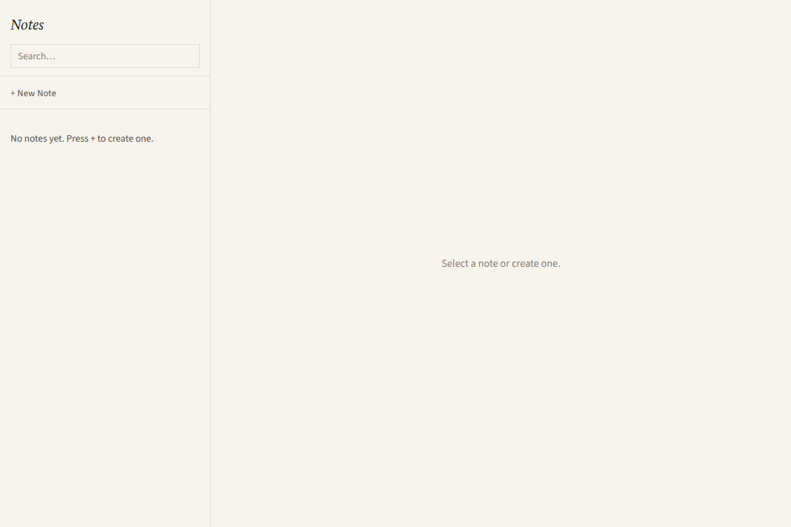
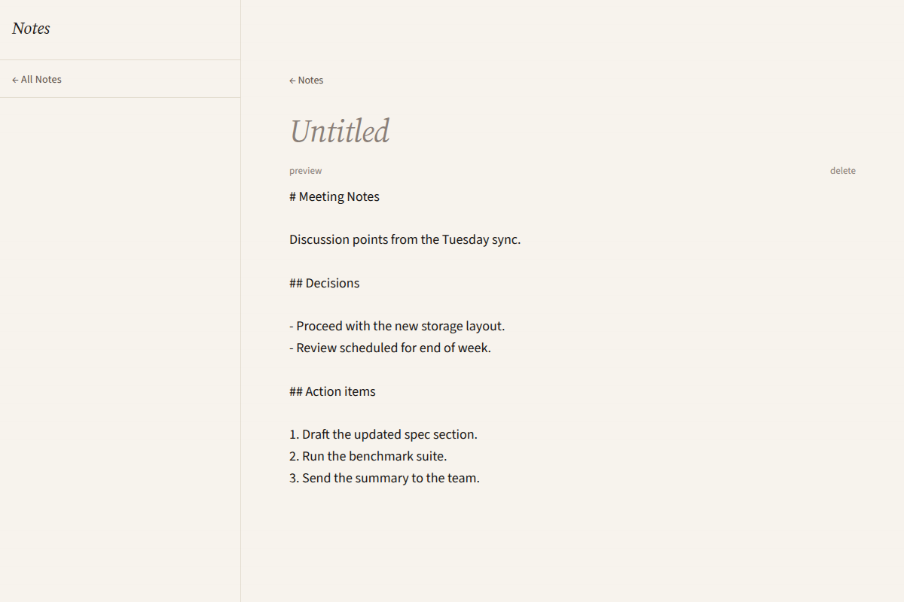
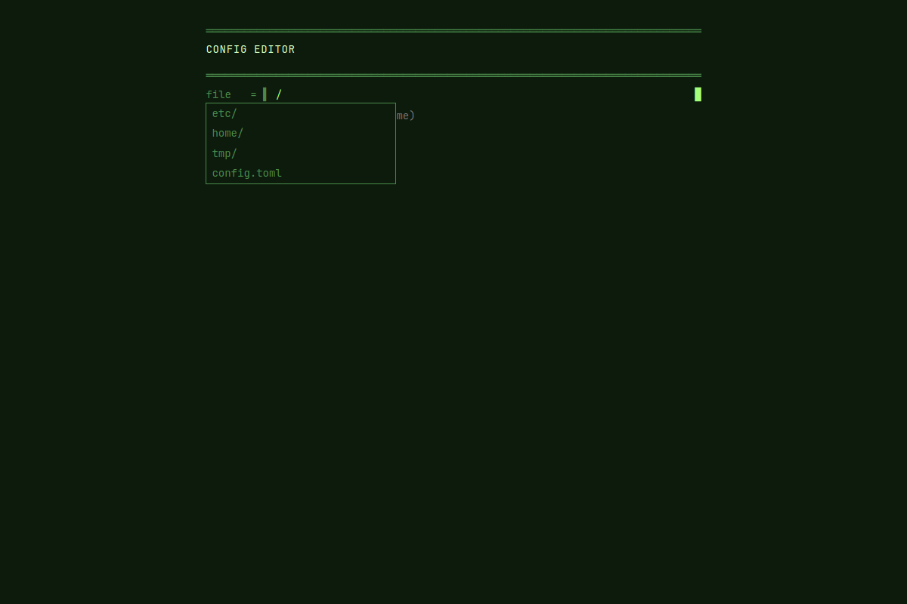
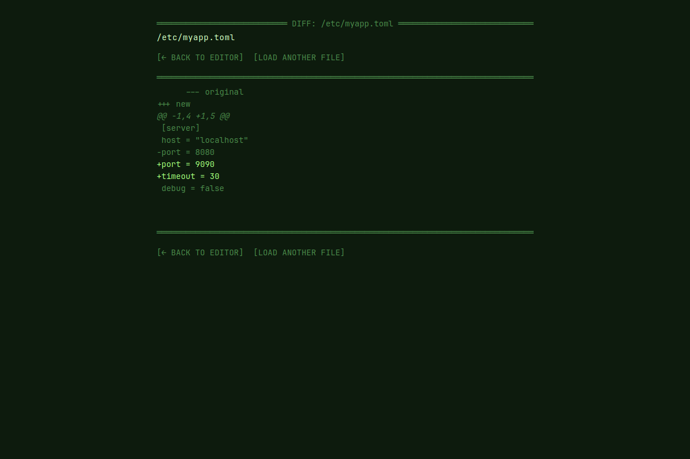
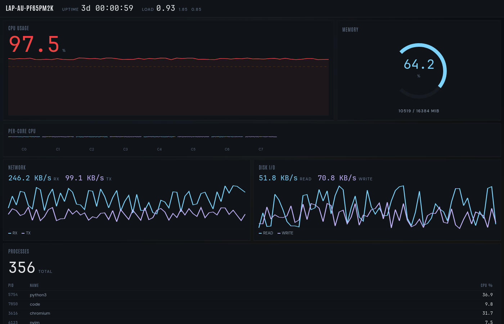
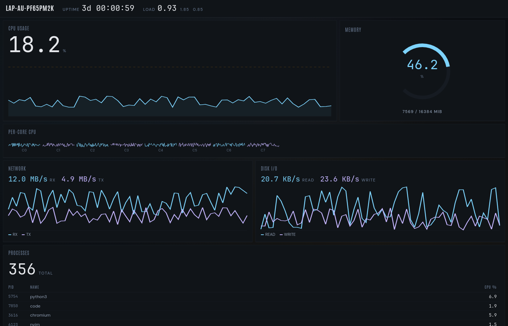

# Picolet examples

Four worked applications demonstrating the Picolet framework across distinct
use cases and visual directions.

| Example | What it demonstrates | Aesthetic |
|---|---|---|
| [pydfu](pydfu/) | Host filesystem + USB + long-running tasks + per-block progress events | Industrial control panel |
| [notes](notes/) | Host filesystem persistence + multi-route Vue Router + markdown rendering | Editorial / refined |
| [config-editor](config-editor/) | Structured-data read/validate/write pipeline + diff confirmation flow | Brutalist terminal |
| [dashboard](dashboard/) | 1 Hz event push + history ring buffer + custom SVG dataviz | Data-dense dark UI |

## Screenshots

### pydfu

| device-list-empty | device-list-populated | flash-mid-progress | flash-complete |
|---|---|---|---|
|  |  |  |  |

### notes

| list-empty | list-populated | edit-pristine | edit-unsaved |
|---|---|---|---|
|  |  |  |  |

### config-editor

| file-picker | edit-toml | edit-yaml-with-errors | diff-add |
|---|---|---|---|
|  |  |  |  |

### dashboard

| full-dashboard | cpu-pinned-state | network-active-state | full-dashboard-with-warning |
|---|---|---|---|
|  |  |  |  |

## Using these as templates

Each example is available as a `picolet init` template:

```
picolet init my-app --template pydfu
picolet init my-notes --template notes
picolet init my-config --template config-editor
picolet init my-dash --template dashboard
```

Run `picolet init --list-templates` to see all available templates.

See [`docs/examples.md`](../docs/examples.md) for a detailed walkthrough of
each application, including the key Python-side patterns and framework concepts
each one demonstrates.
