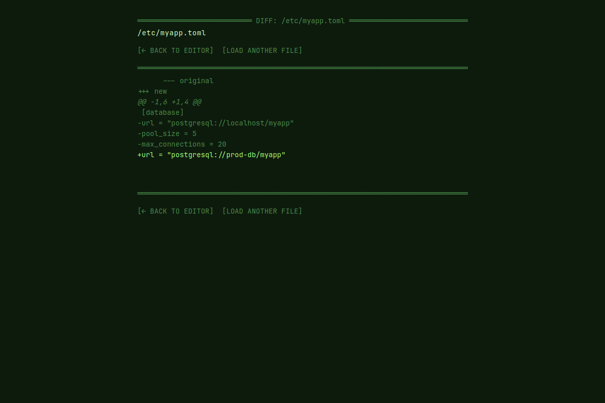

# config-editor

A schema-driven config file editor for TOML, YAML, and JSON. Opens a file,
validates against a registered schema, shows a save-time diff before committing
changes.

The brutalist-terminal aesthetic example — black background, ANSI-green accents,
monospace throughout.

## Screenshots

| Edit TOML | YAML with validation errors | Save-time diff |
|---|---|---|
|  |  |  |

| File picker | Diff (deletion) |
|---|---|
|  |  |

## Picolet features exercised

- Five `@picolet.command` handlers for filesystem browsing, format
  detection, parsing, validation, and save-with-diff.
- Pure-Python TOML + YAML parsers (`tomllib` polyfill, `micro_yaml.py`) —
  no native modules required, demonstrates "fits in MicroPython" parsing.
- `difflib.py` shim for the save-time unified diff.
- Schema validation via a custom mini-validator (`config_validator.py`).
- Vue 3 frontend with a dirty-state guard before destructive ops.

## Built binary size

| Target | Size |
|---|---|
| `linux-x64` | **947 KiB** |

Smaller than `notes` despite richer logic because the UI ships no
third-party JS deps — pure Vue + CSS.

## Build

```bash
cd examples/config-editor
npm install
picolet build
./target/linux-x64/config-editor
```

## Layout

```
config-editor/
├── picolet.toml
├── package.json
├── src/
│   ├── main.py
│   ├── config_store.py         # file IO + parser dispatch
│   ├── config_validator.py     # schema rule engine
│   ├── micro_yaml.py           # YAML parser (pure Python)
│   ├── tomllib.py              # TOML polyfill (re-export from stdlib)
│   └── difflib.py              # diff shim
└── ui/src/
    ├── App.vue
    └── components/
        ├── FilePicker.vue
        ├── Editor.vue
        ├── DiffView.vue
        └── ValidationPanel.vue
```
