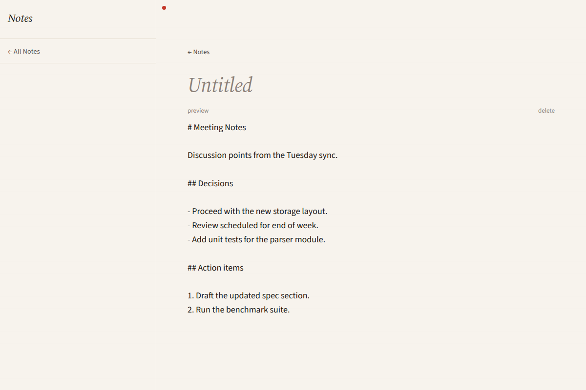
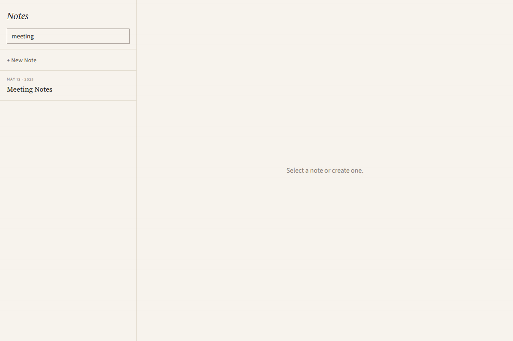

# notes

A markdown notes app — list, create, edit, rename, delete, search. Around
130 lines of Python plus a Vue 3 frontend with `marked` for rendering.

The simplest example that resembles a real application. Persists to the
platform config dir (`~/.config/picolet/notes/` on Linux,
`%APPDATA%\picolet\notes\` on Windows) so notes survive restarts.

## Screenshots

| List | Editor | Search |
|---|---|---|
|  |  |  |

## Picolet features exercised

- Six `@picolet.command` IPC handlers (CRUD + search).
- Filesystem persistence via `os.path` + `pathlib` (`require()`-d from
  micropython-lib in the manifest).
- Vue 3 + vue-router for two-page navigation (list / edit).
- Third-party JS dependency (`marked`) imported via the Vue frontend.
- Unsaved-changes guard implemented on the JS side (the dirty-state pattern
  most apps need).

## Built binary size

| Target | Size |
|---|---|
| `linux-x64` | **1.81 MiB** |

The size jumps over `with-vue` mostly because of `marked` (Markdown parser)
and `vue-router` bundled into the romfs.

## Build

```bash
cd examples/notes
npm install
picolet build
./target/linux-x64/notes
```

Live dev loop:

```bash
picolet dev
```

## Layout

```
notes/
├── picolet.toml
├── package.json            # vue, vue-router, marked
├── src/
│   ├── main.py             # IPC command handlers
│   └── notes_store.py      # filesystem persistence
└── ui/src/
    ├── App.vue
    └── views/
        ├── ListView.vue
        └── EditView.vue
```
