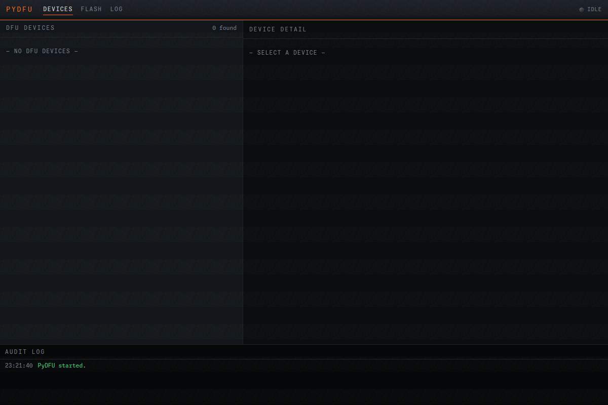
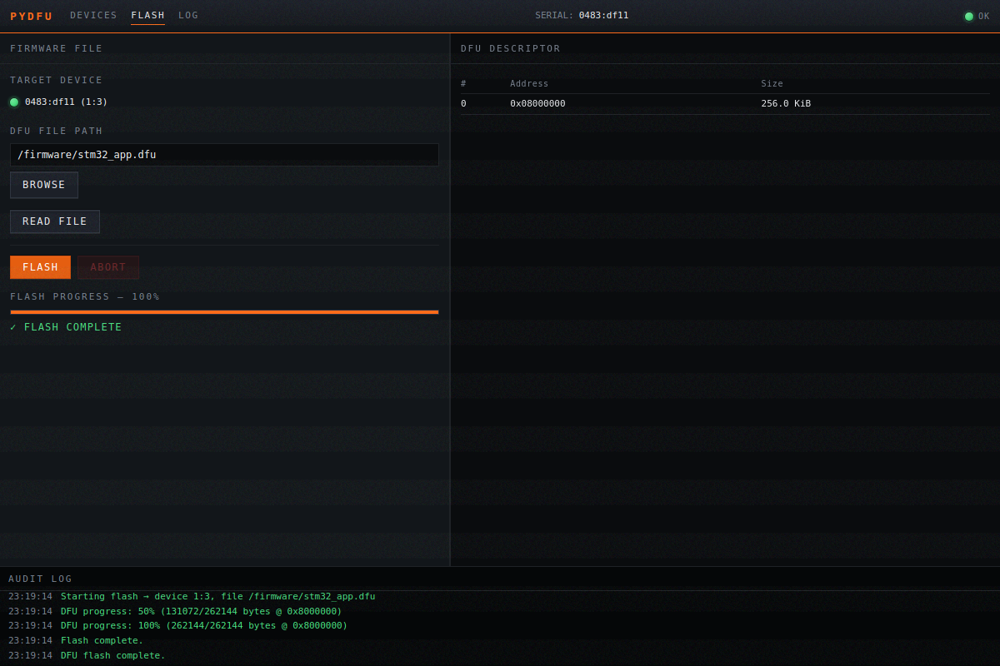
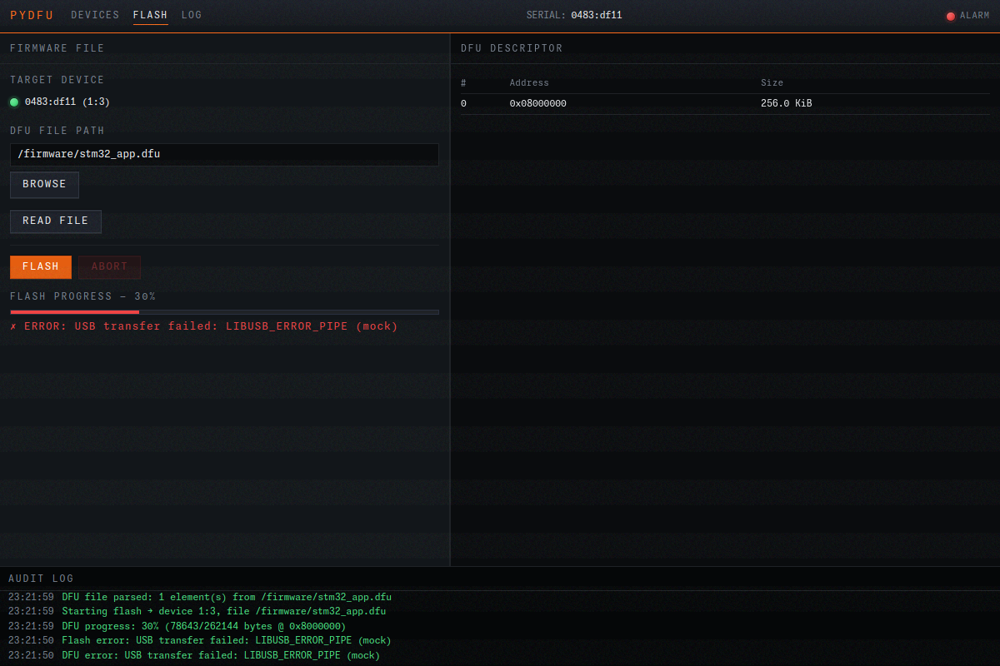

# pydfu

A DFU (Device Firmware Update) flasher with both GUI and CLI modes. Enumerates
USB DFU devices, parses `.dfu` files, and flashes firmware with progress
reporting. Speaks the DFU 1.1 protocol directly over libusb-1.0.

The industrial-control-panel aesthetic example — dense data grid, prominent
progress indicators, audible-style alerts.

## Screenshots

| Empty device list | Device detected | Flash in progress |
|---|---|---|
|  |  |  |

| Flash complete | Flash error |
|---|---|
|  |  |

## Picolet features exercised

- Five `@picolet.command` IPC handlers + three push-event streams
  (`dfu:progress`, `dfu:done`, `dfu:error`).
- `picolet.romfs_extract.extract_dir` — pre-import-time DLL extraction from
  romfs to a writable temp dir on Windows (LoadLibrary can't read the romfs
  VFS).
- Native FFI via the `ffi` module — opens libusb-1.0 by name and calls into
  it directly. Pure Python USB stack (no native module).
- Dual-mode: same binary works as a CLI tool (`pydfu list`, `pydfu flash …`)
  or as a windowed app (default).
- Vendored third-party library: `libusb-1.0.dll` v1.0.26 (LGPL-2.1+) bundled
  in romfs for Windows. SBOM declares it dynamically linked.
- Mock backend (`PICOLET_PYDFU_MOCK=1`) for screenshot generation + CI
  smoke tests without real USB hardware.

## Built binary size

| Target | Size |
|---|---|
| `linux-x64` | **1.21 MiB** |

## Build

```bash
cd examples/pydfu
npm install
picolet build                        # linux-x64 (host auto-detected)
picolet build --target windows-x64   # cross-compile via dockcross
```

The binary is written to `target/<target>/pydfu` (or `.exe` on Windows).

## Run

GUI mode:

```bash
./target/linux-x64/pydfu
```

CLI subcommands:

```bash
./target/linux-x64/pydfu list
./target/linux-x64/pydfu read firmware.dfu
./target/linux-x64/pydfu flash 1:1 firmware.dfu
```

Mock mode (no real device, deterministic — useful for screenshots / CI):

```bash
PICOLET_PYDFU_MOCK=1 ./target/linux-x64/pydfu
```

## USB backend per platform

### Linux

Uses the system libusb-1.0 (`libusb-1.0-0`):

```bash
sudo apt install libusb-1.0-0
```

The `ffi` module opens `libusb-1.0.so.0` at runtime.

### Windows

A vendored `libusb-1.0.dll` (x64, LGPL-2.1+, v1.0.26) ships in the app romfs
at `/rom/src/_usb/libusb-1.0.dll`. No separate install is needed.

On first run, `main.py` extracts the DLL to `%TEMP%\picolet_pydfu\` before any
USB import occurs (Windows `LoadLibrary` can't read from the MicroPython romfs
VFS). The extracted copy is reused on subsequent runs.

### macOS

Install libusb via Homebrew:

```bash
brew install libusb
```

The `ffi` module searches `/opt/homebrew/lib/`, `/usr/local/lib/`, and the
bare name (resolved via `DYLD_LIBRARY_PATH`).

## Layout

```
pydfu/
├── picolet.toml
├── package.json
├── src/
│   ├── main.py             # IPC + CLI argparse; pre-import DLL extract
│   ├── pydfu_adapter.py    # real-USB or mock-USB dispatch
│   ├── pydfu_mock.py       # deterministic mock backend
│   ├── _crc32.py           # pure-Python CRC32
│   ├── _usb/               # pyusb-compatible shim over libusb-1.0 ffi
│   │   ├── core.py         # Device / Configuration / Interface / find()
│   │   └── libusb-1.0.dll  # vendored Windows binary (LGPL-2.1+)
│   └── _pydfu/             # DFU protocol implementation
│       └── pydfu.py        # enumerate, init, write_elements, exit_dfu
└── ui/src/                 # Vue 3 frontend
```

The `_usb/` and `_pydfu/` directories are app-internal (underscore prefix),
ported from the OpenMV pydfu tool and carry the MIT licence.

## Tests

Unit tests (pure Python, no device required):

```bash
pytest tests/phase-19/
```

End-to-end smoke (uses the mock backend; requires the built binary):

```bash
PICOLET_PYDFU_MOCK=1 ./target/linux-x64/pydfu list
```
